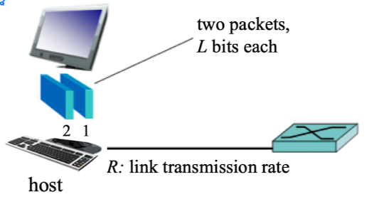

## Network Structure
### 네트워크 구성
 

**Network edge** : 사용자가 네트워크에 **접속되는 지점**

- end system은 웹 브라우저, 서버 프로그램 같은 애플리케이션을 수행하므로 **host**라고도 부른다. 

 

**Network core** : edge로 들어온 **트래픽**이 또다른 edge로 갈 때 **거쳐가는 지점**

- 인터넷의 end system을 연결하는 **패킷 스위치들과 링크들의 연결망** 

 

 

### CISCO가 바라보는 네트워크

1. Access Network - 네트워크, 인터넷 망에 접속하기 위한 프로토콜 (및 장비), Wifi, LAN 등 

- end system -> router 연결하는 network 

2. Distribution Network

3. Core Network 

 

 

 

## Host : sends packets of data 
**packet-switching** (패킷 교환)

- 메세지를 패킷(packet)이라고 하는 작은 데이터 덩어리로 **분할하여 전송**한다. 
- 송신 측과 수신 측 사이에서 각 패킷은 통신 링크와 패킷 스위치를 거치게 된다. 

 

**분할하는 이유?**
- 네트워크를 공유해서 사용하기 때문에 큰 크기의 파일 전송은 길고 안정적이지 않아 작은 단위로 나눠 안정적으로 보냄
-> 받는 쪽에서 reassemble

 

 

### 패킷 전송 경과 시간
packet transmission delay

= time needed to transmit L-bit packet into link

= L(bits) / R(bits/sec) 

 

- L/R 초 시간에 송신 시스템은 전체 패킷을 전송하였고 라우터에 수신되고 저장되었다. 
- L/R 초 시간에 라우터가 전체 패킷을 수신했기 때문에 라우터는 수신 시스템을 향해 그 패킷을 출력 링크로 전송하기 시작한다. 
- 2L/R 기간에 라우터는 전체 패킷을 전송하였고 수신 시스템은 전체 패킷을 수신하였다. 
- 따라서 전체 지연은 2L/R 

 

**소스로부터 목적지 노드까지 N개의 링크로 구성되고 각각 R 전송 속도를 갖는 경우**
- 종단간 지연 d = N * L/R 

 

  

### Packet-Switching 특징 1 : store-and-forward (저장 후 전달)

- 스위치가 출력 링크로 패킷의 첫 비트를 전송하기 전에 전체 패킷을 받아야 하는 것을 뜻함 

 
 
 

### Packet-Switching 특징 2 : queueing delay, loss (큐잉 지연, 패킷 손실)

- 각 패킷 스위치는 접속된 여러 링크를 가지고 있다. 각 링크에 대해 패킷 스위치는 출력 버퍼(큐)를 갖고 있으며, 그 링크로 송신하려는 패킷을 저장하고 있다. 

- 도착하는 패킷은 한 링크로 전송될 필요가 있는데 그 링크가 다른 패킷을 전송하고 있다면 도착하는 패킷은 출력 버퍼에서 대기해야 한다. 

- 따라서 store-and-forware(저장 후 전달) 지연 뿐만 아니라, 패킷은 출력 버퍼에서 queueing delay(큐잉 지연)을 겪게 된다. 

 

버퍼 공간의 크기가 유한하기 때문에 버퍼가 전송을 위해 대기중인 다른 패킷들로 꽉 차있는 경우가 있다. 이 경우 **packet loss(패킷 손실)**가 일어난다. 

- 도착하는 패킷 혹은 이미 큐에 대기 중인 패킷을 폐기한다. 

 

## Circuit-Switching
### 회선 교환

 

 

링크와 스위치의 네트워크를 통해 데이터를 이동시키는 방식에는 

**회선 교환 (circuit-switching)**

**패킷 교환 (packet-switching)**

두 가지 기본방식이 있다. 

  

end system 간에 통신을 제공하기 위해 경로 상에 필요한 자원(버퍼, 링크 전송률)은 통신 세션 동안에 확보 또는 예약(reserve)된다. 패킷 교환 네트워크에서는 이들 자원을 예약하지 않는다. 세션 메세지는 온 디맨드(on-demand) 방식으로 자원을 요청하여 사용하고 그 결과, 통신 링크에 대한 접속을 위해 기다릴 수도 있다.

 
 
 

### Packet-Switching vs Circuit-Switching 

패킷 교환 반대파 

- 가변적이고 예측할 수 없는 종단 간의 지연 (주로 불규칙적이고 예측할 수 없는 큐잉 지연에서 발생) 때문에 패킷 교환은 실시간 서비스에 적합하지 않음

 

패킷 교환 옹호파

- 패킷 교환이 회선 교환보다 전송 용량의 공유에서 더 효율적

- 패킷 교환이 더 간단하고, 효율적이며, 회선 교환보다 구현 비용이 적다. 

 

 

### 패킷 교환이 더 많은 사용자가 네트워크를 이용할 수 있다.

간단 예시 )

1. 사용자가 1Mbps 링크를 공유한다 가정

2. 각 사용자는 활동시간일 때 100kbps의 일정 속도로 데이터 생산

3. 사용자는 전체 시간에서 10%만 활동 

  

- 회선 교환의 경우 100kbps가 항상 각각의 사용자에게 예약되어야 한다. 
- 따라서 회선 교환 링크는 동시에 10명 (1Mbps / 100kbps)만 지원할 수 있다. 

 
 

패킷 교환의 경우 한 사용자가 활동하고 있을 확률은 0.1(10%)이다. 

만약 35명의 사용자가 있다면, 11명 이상의 사용자가 동시에 활동할 확률은 약 0.0004(0.04%)이다. 

따라서 사용자 수에 있어서 거의 3배 이상을 허용한다. 

 

정리

bursty data에 있어서는 packet switching이 우위에 있다. 

- 자원 공유

- 단순하고 call setup이 없음 

(bursty data : 한번씩 크게 발생하는 data) 

 

패킷 지연과 손실로 인해 프로토콜은 안정적인 데이터 전송과 혼잡 제어가 필요하다. 