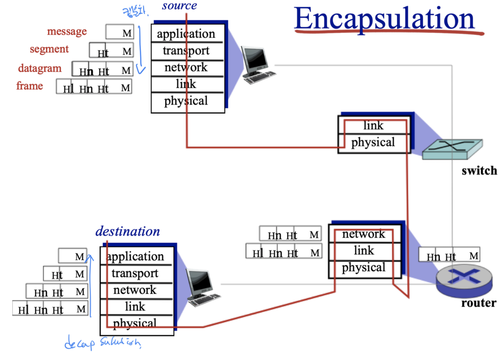

## How do loss and delay occur?
### 패킷 교환 네트워크에서의 지연과 소실 발생

=> **store and forward 특성 때문에 발생**한다

=> **전송 매체를 sharing(공유)**하기 때문에

- packet output link capacity(rate)보다 arrival rate to link가 크게 되면 packet queue가 대기하게 된다. 

- 패킷 출력 링크의 전송률보다 링크 도착률이 크게 되면 패킷이 큐에서 대기하게 된다. 

 
 
 

### Four Sources of Packet Delay

### 패킷 지연의 4가지 요소

 

**전체 지연 d**modal =  **d**proc + **d**queue + **d**trans  + **d**porp

  

1. **d**queue : **queueing delay(큐잉 지연)** - queue에 도착하고나서 빠져나갈 때까지의 delay 

 

- router의 congestion level에 따라 다름 - 큐에 저장되어 링크로 전송되기를 기다리는 다른 패킷의 수에 의해 결정 

- 자료구조 문제. queue를 어떻게 구성하냐에 따라 delay 줄이기 가능

 

2. **d**proc : **processing delay(처리 지연)** - 패킷 헤더를 조사하고 그 패킷을 어디로 보낼지를 결정하는 시간 

 

- queue를 어디에 두는지에 따라 router도 달라지는데, queue로 가기 전까지의 delay 

- 여러 queue 사이에서도 발생 

  

3. **d**trans : **transmission delay(전송 지연)** - queue 맨 앞 packet이 얼마나 빨리 system을 벗어나는가 

 

- L : packet Length (bits)

- R : link bandwidth (bps)

- **d**trans = L / R

  

4. **d**porp : **propagation delay(전파 지연)**- 한 bit가 링크의 처음부터 다음 router에 도착하는 데까지의 delay 

 

 

### 전송 지연 vs 전파 지연 

Transmission delay vs propagation delay

- 전송 지연은 라우터가 패킷을 내보내는 데 필요한 시간 

- 전파 지연은 비트가 한 라우터에서 다음 라우터로 전파되는 데 걸리는 시간 

  

이 중 **줄일 수 있는 delay**는 **processing delay(처리 지연)**과 **queueing delay(큐잉 지연)**

propagation delay(전파 지연)과 transmission delay(전송 지연)은 하드웨어에 따라 결정됨 

1. queueing 알고리즘을 어떻게 할 것인가 

2. processing 을 어떻게 할 것인가

에 따라 delay를 줄일 수 있음 

 

  

 

★ Queueing Delay (큐잉 지연) 

 
 

평균 큐잉 지연의 트래픽 강도 의존성 

 

**La / R > 1**이면,

비트가 큐에 도착하는 평균율이 비트가 큐에서 전송되는 비율을 초과한다. 이 경우 큐는 끝없이 증가하고 큐잉 지연은 무한대에 도달한다. 

 

**La / R <= 1** 이면,

트래픽 강도가 1에 가까울 수록 평균 큐잉 지연이 크다. 

 

**La / R ~ 0** 이면, 

평균 큐잉 지연은 0에 가까워진다. 

 
=> **트래픽 강도(traffic intensity)가 1에 접근할수록 평균 큐잉 지연이 급속히 증가한다.**

 

 

## Packet Loss (패킷 손실) 

**큐가 꽉 차서 패킷을 저장할 수 없는 경우에 라우터는 그 패킷을 버린다(drop). 즉, 그 패킷을 잃어버리게 된다(lost).** 큐에서 이 오버플로우(overflow)는 트래픽 강도가 1보다 클 때 볼 수 있다. 

end system 입장에서, 패킷 손실은 패킷이 네트워크 코어로 전송되었으나 네트워크로부터 목적지에 나타나지 않은 것으로 보일 것이다. 소신 패킷의 비율은 트래픽 강도가 클수록 증가한다. 그러므로 노드에서의 성능은 흔히 지연뿐 아니라 패킷 손실 확률로도 측정한다.  

 

 

### Throughput (처리율)

지연과 패킷 손실 이외에 컴퓨터 네트워크에서의 다른 주요한 성능 수단은 종단간 처리율이다.
Throughput(처리율)은 bits를 전송하는데 걸리는 시간으로 bits/time 으로 보면 된다. 
특정 시점의 처리율인 instantaneous throughput 과 어느 정도의 기간 동안의 처리율인 average throughtput 이 있다. 

 

 

 

 

 

## Protocol Layers : 프로토콜 계층
### layer란? 
각 layer 별로 고유한 서비스가 있다. 

 

### 왜 layer 계층 별로 나누었는가? 

- 크고 복잡한 시스템의 잘 정의된 특정 부분을 논의할 수 있게 해준다. (단순화) 

- 계층 구조를 가지면, 그 계층이 제공하는 서비스의 구현을 변경하는 것도 매우 쉽다. 

- 커다란 시스템의 경우, 시스템의 다른 요소에 영향을 주지 않고 서비스 구현을 변화시키는 능력은 중요한 이점이다. 

 

 

 

## Internet Protocol Stack 인터넷 프로토콜 스택 
**애플리케이션 계층 application** : 네트워크 애플리케이션과 애플리케이션 계층 프로토콜이 있는 곳 

- HTTP, SMTP, FTP

   

**트랜스포트 계층 transport** : 클라이언트와 서버 간에 애플리케이션 계층 메세지를 전송하는 서비스 제공 

- TCP, UDP 

- process-to-process delivery(communication) 

   

**네트워크 계층 network** : 한 호스트에서 다른 호스트로 데이터그램(datagram)을 라우팅하는 책임을 진다. 

- 출발지 호스트에서 인터넷 트랜스포트 게층 프로토콜은 트랜스포트 계층 세그먼트와 목적지 주소를 네트워크 계층으로 전달한다. 그 다음에 네트워크 계층은 목적지 호스트의 트랜스포트 계층으로 세그먼트를 운반하는 서비스를 제공한다. 

- IP, routing 프로토콜 (RIP, OSPF)

- end(node, host)-to-end delivery(communication)

  

**링크 계층 link** : 각 노드에서 네트워크 계층은 데이터그램을 아래 링크 계층으로 보내고, 링크 계층은 그 데이터그램을 경로상의 다음 노드에 전달한다. 다음 노드에서 링크 계층은 그 데이터그램을 상위 네트워크 계층으로 보낸다. 

- 이더넷, Wifi, PPP, HDLC

- hop-to-hop(node-to-node) delivery(communication)

   

**물리 계층 physical** : 프레임 내부의 각 비트를 한 노드에서 다음 노드로 보낸다

 

 

 

## OSI 7 계층 모델 
 

**프레젠테이션 계층 presentation** : 통신하는 애플리케이션들이 교환되는 데이터의 의미를 해석하도록 하는 서비스 제공 

- zip, mp4, jpg 등등

   

**세션 계층 session** : 데이터 교환의 경계와 동기화 제공 

 

 
  
 

### Encapsulation 캡슐화 

한 계층의 정보가 그 밑 계층의 데이터, 메세지가 되는 것

 

### Network Security 
**보안의 3원칙 (3 principle)**

**C** Confidentiality 기밀성 <-> Exposure

**I** Integrity 무결성 <-> Modification 

**A** Availability 가용성 <-> Unavailability 

+

Access Control 접근 제어 

 
  
 

### Malware 맬웨어 (악성코드)

- 오늘날 널리 퍼져 있는 많은 맬웨어는 자기복제를 한다. 

   

**Virus 바이러스** : 사용자의 장치에 영향을 주기 위해서는 사용자의 상호작용이 필요한 맬웨어 

ex ) 전자메일 첨부물  

   

**worm 웜** : 사용자의 직접적인 상호작용 없이 장치에 침투하는 맬웨어 

ex) 공격자가 맬에어를 송신할 수 있는 공격받기 쉬운 네트워크 애플리케이션 수행 

   

**spyware 스파이웨어** : 키 입력, 웹사이트 방문기록, 업로드 기록등을 기록할 수 있음 

 

   

**DoS(Denial of Service)** : 네트워크, 호스트 혹은 다른 기반구조의 요소들을 정상적인 사용자들이 사용할 수 없게 하는 것 

1. select target 타겟을 정한다

2. break into hosts around the network 네트워크 주변 호스트에 침입한다

3. send packets to target from compromised hosts  타겟 호스트로 패킷 전송 

 
  
 

**packet sniffing** : 지나가는 패킷들을 확인하는 공격 
 
- 전송 매체를 공유하기 때문에 가능하다

   

**IP spoofing** : 거짓된 출발지 주소를 가진 패킷을 인터넷으로 보내는 능력 

- 한 사용자가 다른 사용자인 것처럼 행동하는 여러 가지 방법 중 하나 