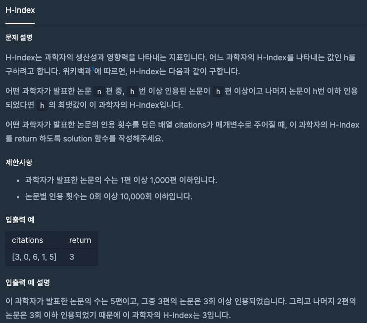

  
## 문제
[[프로그래머스 - JAVA] 정렬 - Level 2 H-Index](https://programmers.co.kr/learn/courses/30/lessons/42747)

 

## 풀이

- 인용 횟수 배열 citations 정렬시킴 (내림차순으로 정렬하려 했으나 방법이 귀찮아 맨 뒤 index부터 사용하는 방식으로 함)
- 맨 뒤 index부터 피인용수 > index 되기 전까지 구함 
- 이 지점이 피인용수만큼 인용된 논문 수가 있는 최댓값

```java
import java.util.*;
class Solution {
    public int solution(int[] citations) {
        int answer = 0;
        int len = citations.length;
        
        Arrays.sort(citations);
        
        for(int i = 1; i <= len ; i++){
            if(i <= citations[len - i]){
                answer = i;
            }
        }
        return answer;
    }
}
```

- 몇번 머리로만 생각하고 코드를 짰을때 어딘가 틀려서 안됐었다. 
- 어느정도의 손으로 써서 정리하고나서 구현하는 것이 훨씬 안전한 것 같다. 

---