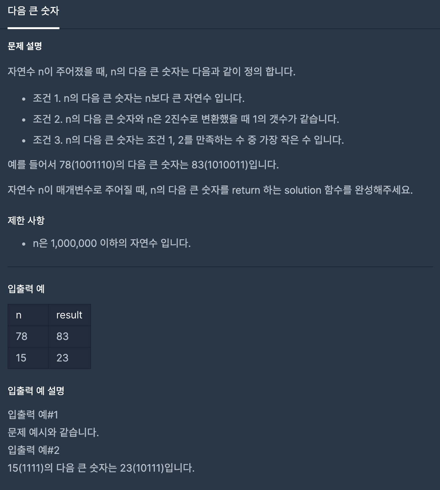

## 문제

[[프로그래머스 - JAVA] 연습문제 - Level 2 다음 큰 숫자](https://programmers.co.kr/learn/courses/30/lessons/12911)



## 풀이
- 숫자 n을 2진수 문자열로 만들고 1의 개수를 센다.
- n + 1 부터 2진수 문자열로 만들고 1의 개수를 세서 같은 수가 나오면 break

<br/>

```java
class Solution {
  public int solution(int n) {
      int answer = n;
      
      String str = Integer.toBinaryString(n);
      
      int count = 0;
      for(char c : str.toCharArray()){
          if(c == '1')
              count++;
      }
      
      for(answer = n + 1; answer <= 1000000; answer++){
          str = Integer.toBinaryString(answer);
          int num = 0;
          for(char c : str.toCharArray()){
              if(c == '1')
                  num++;
          }
          if(num == count)
              break;
      }
      return answer;
  }
}
```

<br/>

### 다른 풀이

- Integer.bitCount() 라는 함수를 사용하였다. 
- 2진수로 바꾼 후 1의 개수를 반환하는 함수이다. 


```java
class Solution {
    public int solution(int n) {
        int answer = 0;
        int count = Integer.bitCount(n);
        
        while(true){
            int c = Integer.bitCount(++n);
            if(count == c){
                answer = n;
                break;
            }
        }
        
        return answer;
    }
}
```


---

<br/>

- 처음 접근할 때 괜히 다 2진수로 바꾸는 연산을 해서 문제를 더 어렵게 생각했었다. 
- 생각보다 2진수 변환 함수가 빨라서 내장 함수를 쓰는 걸 꺼리지 말아야겠다. 