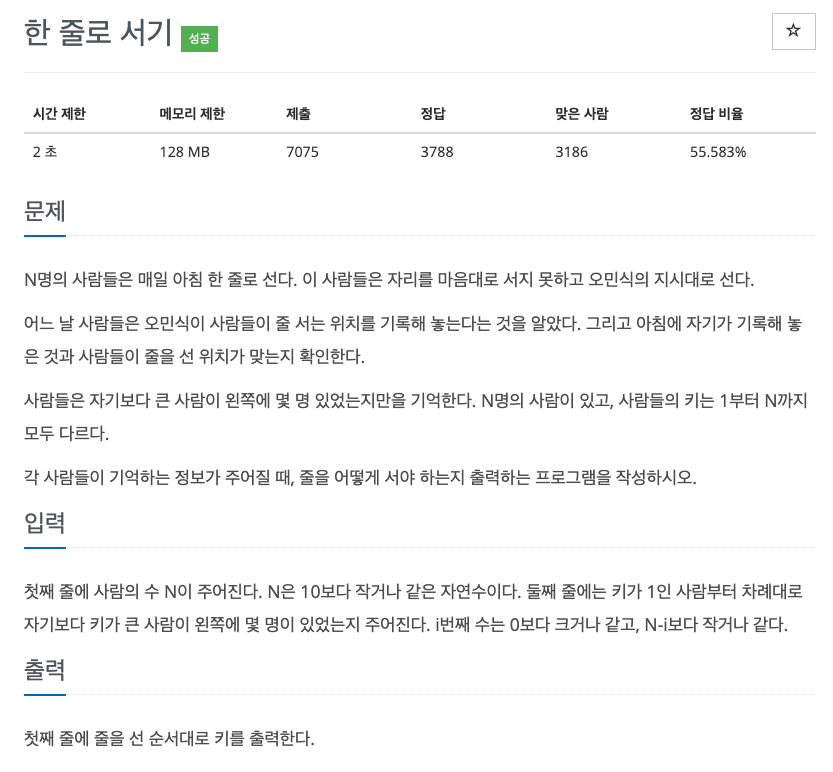
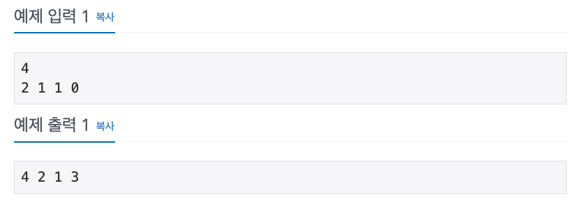

## 문제

[[백준 - JAVA] Silver 2 - 1138 한줄로서기](https://www.acmicpc.net/problem/1138)




## 풀이

- 구현 문제
- 자기보다 큰 사람만을 기억한다는 것을 유의

<br/>

```java
import java.io.*;
import java.util.*;

public class BOJ_1138_한줄로서기 {

	public static void main(String[] args) throws NumberFormatException, IOException {
		BufferedReader in = new BufferedReader(new InputStreamReader(System.in));

		int N = Integer.parseInt(in.readLine());

		int[] people = new int[N + 1];
		List<Integer> list = new ArrayList<Integer>();

		StringTokenizer st = new StringTokenizer(in.readLine());
		for (int i = 1; i <= N; i++)
			people[i] = Integer.parseInt(st.nextToken());

		for(int i = N ; i > 0; i--) {
			list.add(people[i], i);
		}

		StringBuilder sb = new StringBuilder();
		for(int i = 0 ; i < N ;i++) {
			sb.append(list.get(i)).append(" ");
		}
		System.out.println(sb);
	}
}


```

<br/>

- 처음엔 리스트에 플래그에 복잡하게 접근했다가 큰거부터 보니 작은 것들은 의미없다는 것을 깨닫고 큰 것부터 처리하는 방식으로 구현
