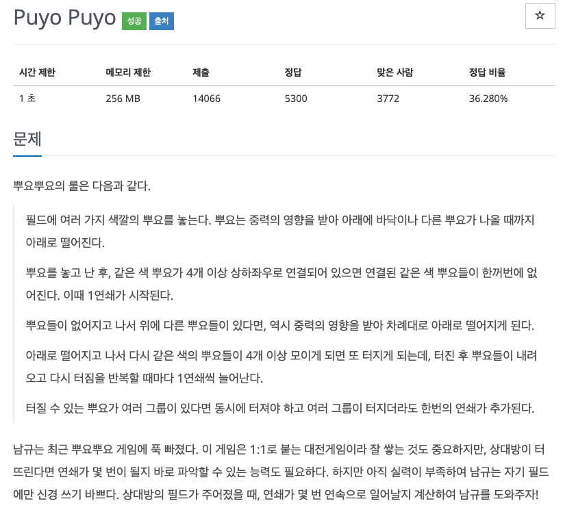
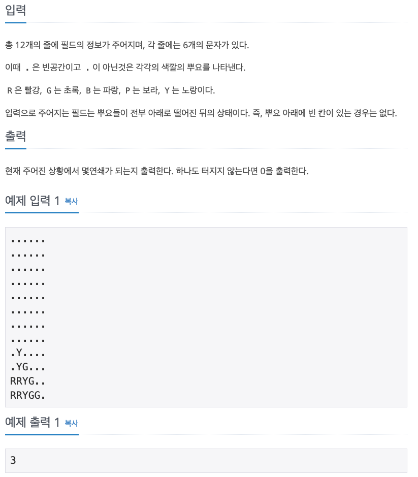

## 문제

[[백준 - JAVA] Gold 5 - 11559 Puyo Puyo](https://www.acmicpc.net/problem/11559)




## 풀이

- 구현 + BFS 문제
- 4개 이상 같은 뿌요 터뜨리는 함수 1개 (BFS 사용하여 4개 이상 붙어있는지 검사)
- 터뜨린 후 빈칸 아래로 땡기는 함수 1개
- 2개 함수를 구현

<br/>

```java
import java.io.*;
import java.util.*;

public class BOJ_11559_PuyoPuyo {

	static int answer = 0;
	static int[] dx = { 0, 0, 1, -1 };
	static int[] dy = { 1, -1, 0, 0 };
	static char[][] map;

	public static void main(String[] args) throws IOException {
		BufferedReader in = new BufferedReader(new InputStreamReader(System.in));
		String st = null;
		map = new char[12][6];
		for (int i = 0; i < 12; i++) {
			st = in.readLine();
			for (int j = 0; j < 6; j++) {
				map[i][j] = st.charAt(j);
			}
		}

		while (check()) {
			answer++;
			move();
		}

		System.out.println(answer);
	}

	static void move() {
		Queue<Character> ch = new LinkedList<Character>();
		for (int j = 0; j < 6; j++) {
			ch.clear();
			for (int i = 11; i >= 0; i--) {
				if (map[i][j] != '.')
					ch.add(map[i][j]);
			}

			for (int i = 11; i >= 0; i--) {
				if (ch.isEmpty())
					map[i][j] = '.';
				else
					map[i][j] = ch.poll();
			}
		}

	}

	static boolean check() {
		boolean[][] visited = new boolean[12][6];
		boolean flag = false;
		Queue<int[]> q = new LinkedList<>();
		List<int[]> list = new ArrayList<>();

		for (int i = 11; i >= 0; i--) {
			for (int j = 5; j >= 0; j--) {
				list.clear();
				if (!visited[i][j] && map[i][j] != '.') {
					q.add(new int[] { i, j });
					visited[i][j] = true;
					while (!q.isEmpty()) {
						int x = q.peek()[0];
						int y = q.poll()[1];
						char cur = map[i][j];
						list.add(new int[] { x, y });

						for (int d = 0; d < 4; d++) {
							int mx = x + dx[d];
							int my = y + dy[d];

							if (mx < 0 || my < 0 || mx >= 12 || my >= 6)
								continue;

							if (visited[mx][my] || map[mx][my] != cur)
								continue;

							visited[mx][my] = true;
							q.add(new int[] { mx, my });
						}
					}
					if (list.size() >= 4) {
						flag = true;
						for (int[] arr : list) {
							map[arr[0]][arr[1]] = '.';
						}
					}
				}
			}
		}
		return flag;
	}
}
```

<br/>

- 처음에 생각없이 DFS 방법으로 가려다가 생각을 잠시 해보니 BFS가 훨씬 효율적일 것 같아서 BFS로 구현하였다.
- 느낌대로 말고 생각을 잠시 해보고 접근하자...!! 그냥 접근했으면 DFS 써서 오래걸리거나 못풀어서 BFS로 푸는데 시간이 더 오래 걸렸을 것이다.
