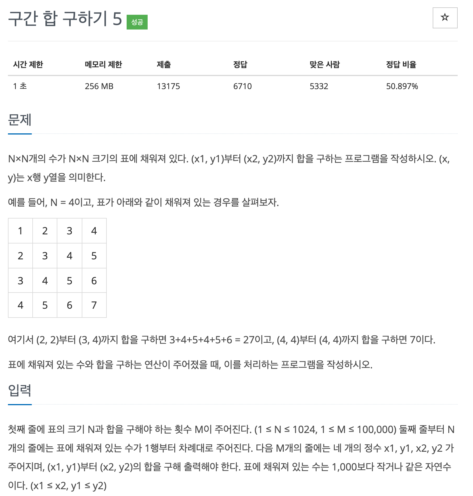
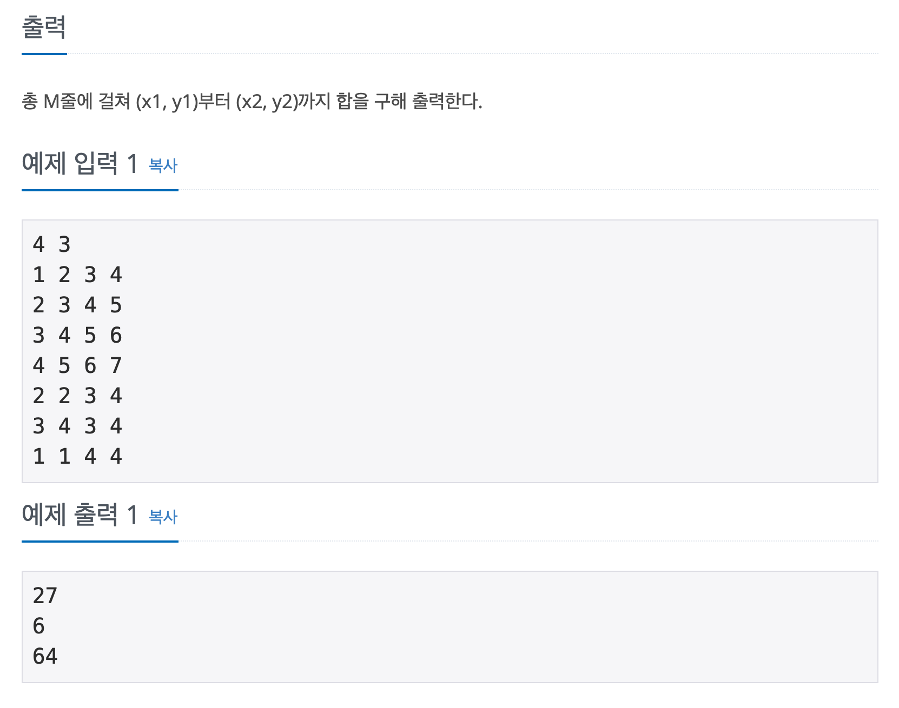

## 문제

[[백준 - JAVA] Silver 1 - 11660 구간 합 구하기](https://www.acmicpc.net/problem/11660)




## 풀이

- 일반적으로 배열을 돌면서 구하면 시간초과
- 구간 합을 저장하는 배열 생성하여 특정 구간 합 계산하는 방식으로 풀어야 함

<br/>

### 첫 풀이 (시간 초과)

```java
import java.io.*;
import java.util.StringTokenizer;

public class Main {

	static int[][] map;
	public static void main(String[] args) throws IOException {
		BufferedReader in = new BufferedReader(new InputStreamReader(System.in));
		StringTokenizer st = new StringTokenizer(in.readLine());

		int N = Integer.parseInt(st.nextToken());
		int M = Integer.parseInt(st.nextToken());

		map = new int[N][N];
		for(int i = 0 ; i < N ; i++) {
			st = new StringTokenizer(in.readLine());
			for(int j = 0 ; j < N ; j++) {
				map[i][j] = Integer.parseInt(st.nextToken());
			}
		}
		StringBuilder sb = new StringBuilder();
		for(int i = 0; i < M ; i++) {
			st = new StringTokenizer(in.readLine());
			int x1 = Integer.parseInt(st.nextToken()) - 1;
			int y1 = Integer.parseInt(st.nextToken()) - 1;
			int x2 = Integer.parseInt(st.nextToken()) - 1;
			int y2 = Integer.parseInt(st.nextToken()) - 1;
			sb.append(func(x1, y1, x2, y2)).append("\n");
		}

		System.out.println(sb);
	}

	static int func(int x1, int y1, int x2, int y2) {
		int result = 0;
		for(int i = x1 ; i <= x2; i++) {
			for(int j = y1 ; j <= y2; j++) {
				result += map[i][j];
			}
		}

		return result;
	}
}

```

### 맞은 풀이

```java
import java.io.*;
import java.util.StringTokenizer;

public class Main {

	static int[][] map, dp;

	public static void main(String[] args) throws IOException {
		BufferedReader in = new BufferedReader(new InputStreamReader(System.in));
		StringTokenizer st = new StringTokenizer(in.readLine());

		int N = Integer.parseInt(st.nextToken());
		int M = Integer.parseInt(st.nextToken());

		map = new int[N + 1][N + 1];
		dp = new int[N + 1][N + 1];
		for (int i = 1; i <= N; i++) {
			st = new StringTokenizer(in.readLine());
			for (int j = 1; j <= N; j++) {
				map[i][j] = Integer.parseInt(st.nextToken());
			}
		}

		for (int i = 1; i <= N; i++) {
			for (int j = 1; j <= N; j++) {
				dp[i][j] = dp[i - 1][j] + dp[i][j - 1] - dp[i - 1][j - 1] + map[i][j];
			}
		}

		StringBuilder sb = new StringBuilder();
		for (int i = 0; i < M; i++) {
			st = new StringTokenizer(in.readLine());
			int x1 = Integer.parseInt(st.nextToken());
			int y1 = Integer.parseInt(st.nextToken());
			int x2 = Integer.parseInt(st.nextToken());
			int y2 = Integer.parseInt(st.nextToken());
			sb.append(dp[x2][y2] - dp[x2][y1 - 1] - dp[x1 - 1][y2] + dp[x1 - 1][y1 - 1]).append("\n");
		}

		System.out.println(sb);
	}

}

```

<br/>

- 2022 KAKAO BLIND 코딩테스트 6번 문제 유형과 비슷해서 풀어보았음.
