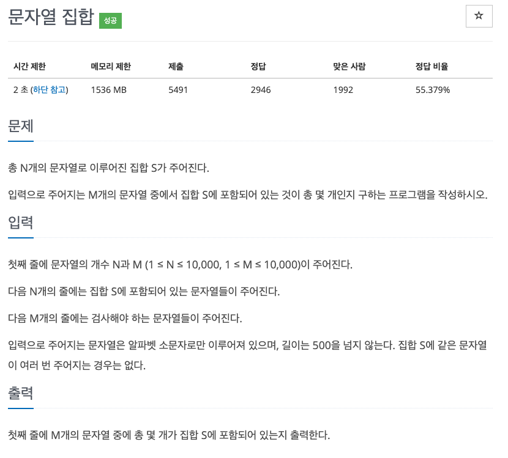
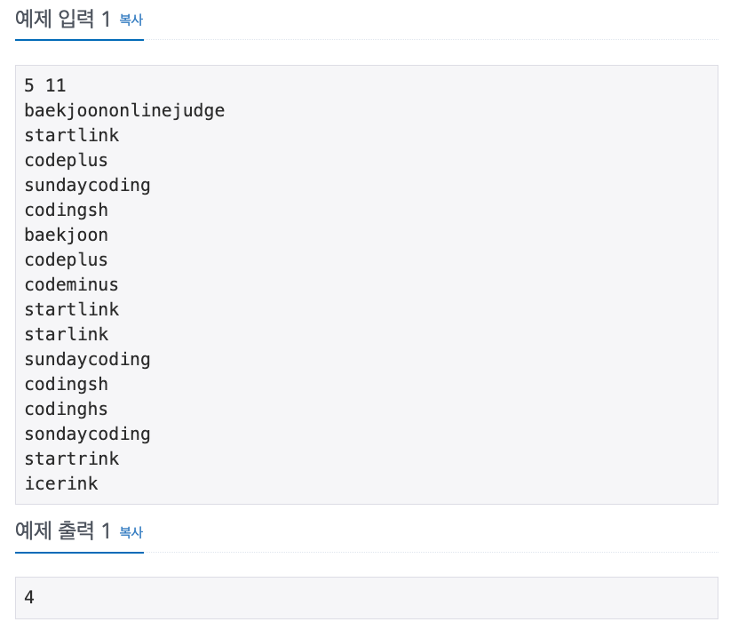

## 문제

[[백준 - JAVA] Silver 3 - 14425 문자열 집합](https://www.acmicpc.net/problem/14425)




## 풀이

- 첫 풀이 접근을 List에 저장하고 길이순, 알파벳순으로 정렬해서 비교하면 10000\*10000 보다는 연산을 덜 할 것 같아서 진행헀지만, 시간초과도 아닌 틀렸습니다. 문구가 계속 떠서...
- 다른 방법을 찾던 중 HashMap의 get 메소드 시간복잡도가 O(1)임을 알게되어 바로 활용하였다.

<br/>

```java
import java.io.*;
import java.util.*;

public class Main {

	public static void main(String[] args) throws IOException {
		BufferedReader in = new BufferedReader(new InputStreamReader(System.in));
		StringTokenizer st = new StringTokenizer(in.readLine());

		int N = Integer.parseInt(st.nextToken());
		int M = Integer.parseInt(st.nextToken());
		int count = 0;

		Map<String,Integer> map = new HashMap<String, Integer>();

		for (int i = 0; i < N; i++) {
			map.put(in.readLine(), 1);
		}

		for (int i = 0; i < M; i++) {
			if(map.get(in.readLine()) != null)
				count++;
		}

		System.out.println(count);
	}
}

```

<br/>

## ArrayList vs HashMap

### ArrayList

- ArrayList.contains() 호출 시 해당 값이 list에 있는지 파악하기 위해 내부적으로 indexOf(object) 메소드를 사용한다. 이 메소드는 array 전체를 돌면서 비교를 진행하기 때문에 **O(n)** 의 시간이 걸린다.

### HashMap

- HashMap.containsKey(object) 호출 시 HashMap 구조가 활용된다. **O(1)**의 시간이 걸린다.

> 매우 중요하니 꼭 기억해두자
