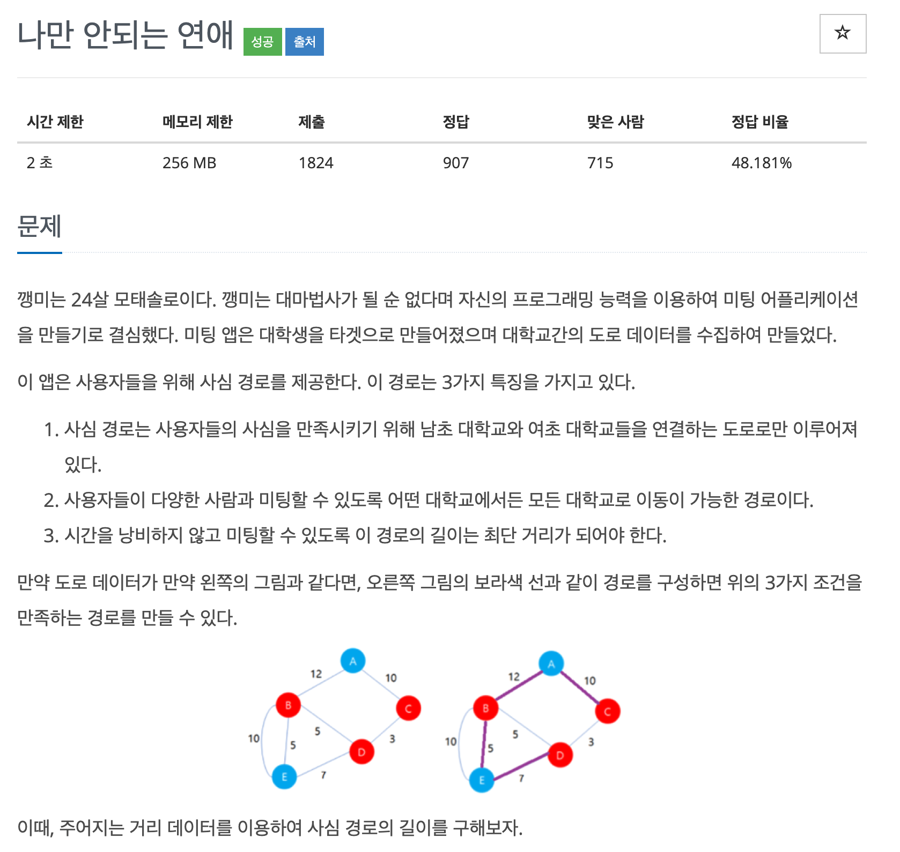
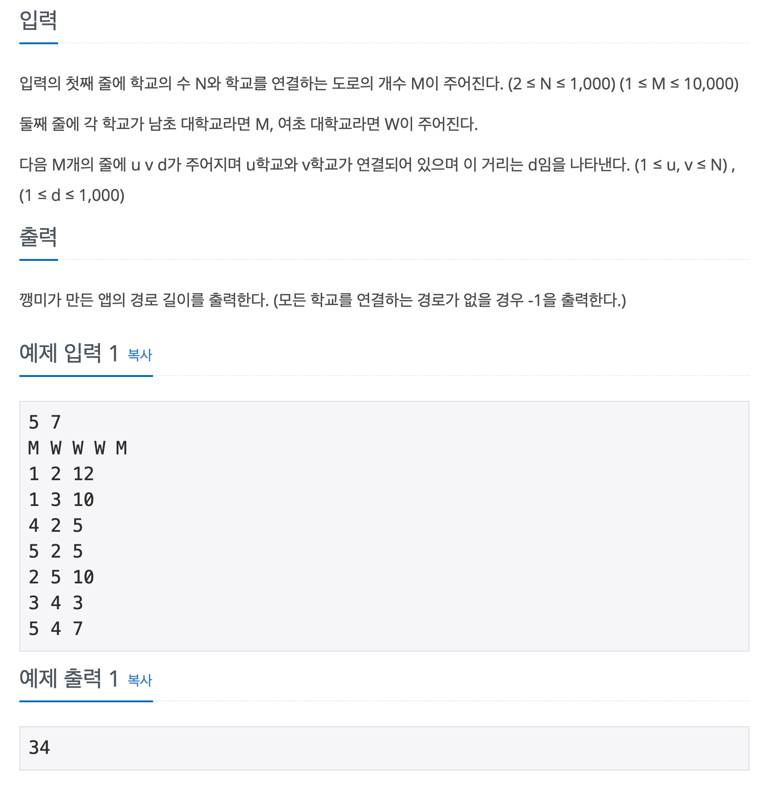

## 문제

[[백준 - JAVA] Gold 3 - 14621 나만안되는연애](https://www.acmicpc.net/problem/14621)




## 풀이

- 크루스칼 알고리즘을 사용하면 쉽게 풀리는 문제.
- Edge를 연결하는 과정에서 시작점과 도착점의 성별이 다를 경우에만 연결하면 된다.

<br/>

```java
import java.io.*;
import java.util.*;

public class Main {

	static class Edge implements Comparable<Edge> {

		int from, to, weight;

		public Edge(int from, int to, int weight) {
			this.from = from;
			this.to = to;
			this.weight = weight;
		}

		@Override
		public int compareTo(Edge o) {
			return this.weight - o.weight;
		}

	}

	static int[] parent;
	static int N, M;
	static Edge[] edges;

	private static void make() {
		for (int i = 1; i <= N; i++)
			parent[i] = i;
	}

	private static int find(int a) {
		if (parent[a] == a)
			return a;

		return parent[a] = find(parent[a]);
	}

	private static boolean union(int a, int b) {
		int aRoot = find(a);
		int bRoot = find(b);
		if (aRoot == bRoot)
			return false;

		parent[bRoot] = aRoot;
		return true;
	}

	public static void main(String[] args) throws IOException {
		BufferedReader in = new BufferedReader(new InputStreamReader(System.in));
		StringTokenizer st = new StringTokenizer(in.readLine());

		N = Integer.parseInt(st.nextToken());
		M = Integer.parseInt(st.nextToken());

		char[] gender = new char[N + 1];
		st = new StringTokenizer(in.readLine());
		for (int i = 1; i <= N; i++) {
			gender[i] = st.nextToken().charAt(0);
		}

		parent = new int[N + 1];
		edges = new Edge[M];
		make();
		int result = 0;
		int count = 0;

		for (int i = 0; i < M; i++) {
			st = new StringTokenizer(in.readLine());
			int from = Integer.parseInt(st.nextToken());
			int to = Integer.parseInt(st.nextToken());
			int weight = Integer.parseInt(st.nextToken());
			edges[i] = new Edge(from, to, weight);
		}

		Arrays.sort(edges);

		for (Edge edge : edges) {
			if (gender[edge.from] != gender[edge.to]) {
				if (union(edge.from, edge.to)) {
					result += edge.weight;
					if (++count == N - 1)
						break;
				}
			}
		}

		if(count != N - 1)
			System.out.println(-1);
		else
			System.out.println(result);

	}
}

```

<br/>

- 풀이 자체는 크루스칼 알고리즘을 사용하여 빠르게 하였지만, 실수가 있었다.
- 문제를 끝까지 정독하지 않아서 연결할 수 없을 경우 -1을 출력하라는 문장을 보지 못했다.
- 문제 정독을 잘하자...
