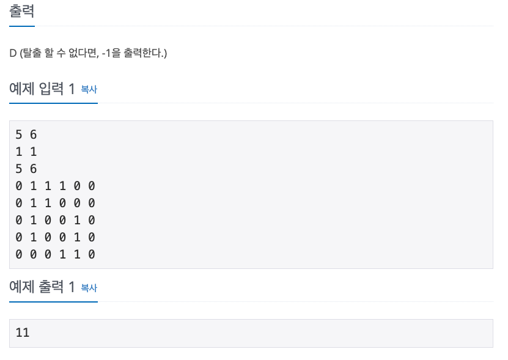

## 문제

[[백준 - JAVA] Gold 4 - 14923 미로 찾기](https://www.acmicpc.net/problem/14923)




## 풀이

- 처음에 벽인 칸들을 하나씩 빈칸으로 바꾸고 BFS를 도는 방법으로 생각을 하였는데
- 생각해보면 시간복잡도상 너무 시간이 오래 걸리는 방법이었다.
- visited 방문 체크 배열에 벽을 한번 넘었는지 여부를 추가하여 3차원 배열로 구성하고
- 한번 넘은 적이 있으면 그 다음부턴 못넘게 하는 식으로 BFS를 단 한번만 돌게 구현하였다.

<br/>

```java
import java.io.*;
import java.util.*;

public class BOJ_14923_미로탈출 {
	static int answer, hx, hy, ex, ey, N, M;
	static int[] dx = { 0, 0, 1, -1 };
	static int[] dy = { 1, -1, 0, 0 };
	static int[][] map;

	public static void main(String[] args) throws IOException {
		BufferedReader in = new BufferedReader(new InputStreamReader(System.in));
		StringTokenizer st = new StringTokenizer(in.readLine());

		N = Integer.parseInt(st.nextToken());
		M = Integer.parseInt(st.nextToken());
		answer = Integer.MAX_VALUE;

		st = new StringTokenizer(in.readLine());
		hy = Integer.parseInt(st.nextToken());
		hx = Integer.parseInt(st.nextToken());

		st = new StringTokenizer(in.readLine());
		ey = Integer.parseInt(st.nextToken());
		ex = Integer.parseInt(st.nextToken());

		map = new int[M + 1][N + 1];
		for (int i = 1; i <= N; i++) {
			st = new StringTokenizer(in.readLine());
			for (int j = 1; j <= M; j++) {
				map[j][i] = Integer.parseInt(st.nextToken());
			}
		}

		func();

		if (answer == Integer.MAX_VALUE)
			System.out.println(-1);
		else
			System.out.println(answer);
	}

	static void func() {
		boolean[][][] visited = new boolean[M + 1][N + 1][2];
		Queue<int[]> q = new LinkedList<>();
		q.add(new int[] { hx, hy, 0, 0 });
		visited[hx][hy][0] = true;
		while (!q.isEmpty()) {
			int cx = q.peek()[0];
			int cy = q.peek()[1];
			int cnt = q.peek()[2];
			int wall = q.poll()[3];

			if (cx == ex && cy == ey)
				answer = Math.min(answer, cnt);

			for (int d = 0; d < 4; d++) {
				int mx = cx + dx[d];
				int my = cy + dy[d];

				if (mx < 1 || my < 1 || mx > M || my > N)
					continue;

				if (map[mx][my] == 1) {
					if (visited[mx][my][1])
						continue;
					if (wall == 0) {
						visited[mx][my][1] = true;
						q.add(new int[] { mx, my, cnt + 1, 1 });
					}
				} else {
					if (visited[mx][my][wall])
						continue;
					q.add(new int[] { mx, my, cnt + 1, wall });
					visited[mx][my][wall] = true;
				}
			}
		}
	}
}

```

<br/>
