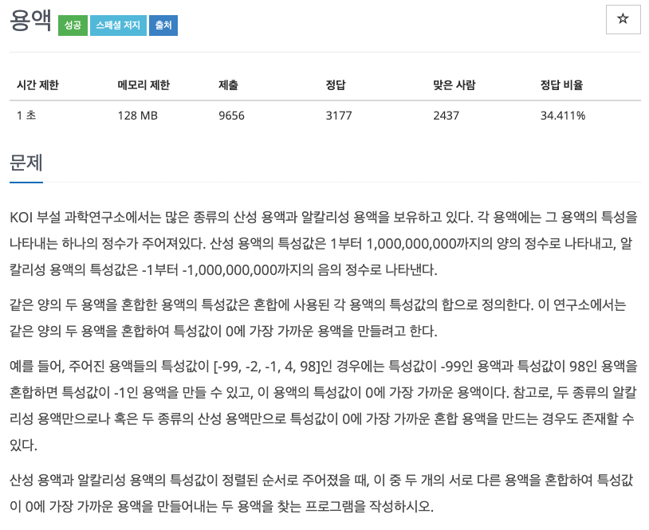

## 문제

[[백준 - JAVA] Gold 5 - 2467 용액](https://www.acmicpc.net/problem/2467)




## 풀이

- 이분탐색 문제

<br/>

```java
import java.io.*;
import java.util.StringTokenizer;

public class Main {

	public static void main(String[] args) throws NumberFormatException, IOException {
		BufferedReader in = new BufferedReader(new InputStreamReader(System.in));

		int N = Integer.parseInt(in.readLine());
		int[] nums = new int[N];

		StringTokenizer st = new StringTokenizer(in.readLine());
		for (int i = 0; i < N; i++)
			nums[i] = Integer.parseInt(st.nextToken());

		int start = 0, end = N - 1;
		int sum = Integer.MAX_VALUE;
		int res1 =0, res2 = 0;
		while(start < end) {

			int n1 = nums[start];
			int n2 = nums[end];

			int mix = Math.abs(n1 + n2);
			if(mix < sum) {
				sum = mix;
				res1 = n1;
				res2 = n2;
			}

			if(n1 + n2 < 0)
				start++;
			else
				end--;
		}

		StringBuilder sb = new StringBuilder();
		sb.append(res1).append(" ").append(res2);
		System.out.println(sb);
	}
}


```

<br/>

- 이분탐색 문제를 오랜만에 접하니 어떻게 푸는지 생각해내는데 좀 시간이 걸렸다.
- 전형적인 이분탐색 문제로 이 문제를 좀 기억을 특별히 해놔야겠다.
