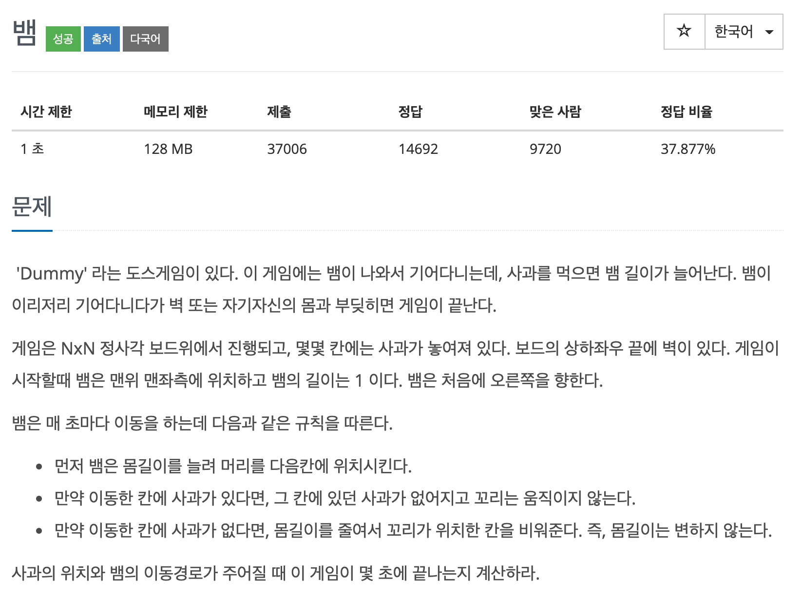
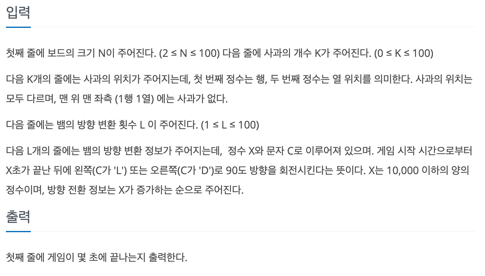

## 문제

[[백준 - JAVA] Gold 5 - 3190 뱀](https://www.acmicpc.net/problem/3190)




## 풀이

- 전형적인(?) 구현 문제.
- 현재 뱀 좌표를 저장할 때 Queue가 생각나는, Queue를 쓰면 더 효율적일 것 같은 느낌이긴 한데 우선 List로 구현해서 풀어봤다.

<br/>

```java
import java.io.*;
import java.util.*;

public class Main {

	static int[] dx = { 0, 1, 0, -1 };
	static int[] dy = { 1, 0, -1, 0 };

	public static void main(String[] args) throws NumberFormatException, IOException {
		BufferedReader in = new BufferedReader(new InputStreamReader(System.in));
		StringTokenizer st = null;
		int N = Integer.parseInt(in.readLine());
		int K = Integer.parseInt(in.readLine());

		List<int[]> snake = new ArrayList<>();
		int[][] map = new int[N + 1][N + 1];
		int[][] apple = new int[K][2];
		for (int i = 0; i < K; i++) {
			st = new StringTokenizer(in.readLine());
			int x = Integer.parseInt(st.nextToken());
			int y = Integer.parseInt(st.nextToken());
			map[x][y] = 1;
		}

		int L = Integer.parseInt(in.readLine());
		int idx = 0;
		snake.add(new int[] { 1, 1 });

		int[][] changes = new int[L][2];
		for (int i = 0; i < L; i++) {
			st = new StringTokenizer(in.readLine());
			changes[i][0] = Integer.parseInt(st.nextToken());
			char c = st.nextToken().charAt(0);
			if (c == 'L')
				changes[i][1] = 0;
			else
				changes[i][1] = 1;
		}

		int count = 0;
		int turn = 0;
		int curx = 1;
		int cury = 1;
		boolean finish = false;
		while (true) {
			count++;

			int nextx = curx + dx[idx];
			int nexty = cury + dy[idx];

			if (nextx == 0 || nextx == N + 1 || nexty == 0 || nexty == N + 1)
				break;

			for (int i = 0; i < snake.size(); i++) {
				int[] c = snake.get(i);
				if (c[0] == nextx && c[1] == nexty)
					finish = true;
				if (finish)
					break;
			}

			if (finish)
				break;

			if (map[nextx][nexty] == 1) {
				map[nextx][nexty] = 0;
				snake.add(0, new int[] { nextx, nexty });
			} else {
				snake.add(0, new int[] { nextx, nexty });
				snake.remove(snake.size() - 1);
			}

			curx = nextx;
			cury = nexty;

			if (turn < L && count == changes[turn][0]) {
				if (changes[turn][1] == 1)
					idx = (idx + 1) % 4;
				else
					idx = (idx + 3) % 4;
				turn++;
			}
		}

		System.out.println(count);

	}
}


```

<br/>

- 함수를 몇개 나눠서 코드를 작성하면 더 좋을 것 같다. 너무 main에 때려 박았다. 지금은..
- 어제 문제와 마찬가지로 핵심 구현은 다 하고 실수가 있었다.
- 사과를 먹고 사과를 지워야 했는데 안지워서 이걸 찾는데 좀 시간이 걸렸다.
