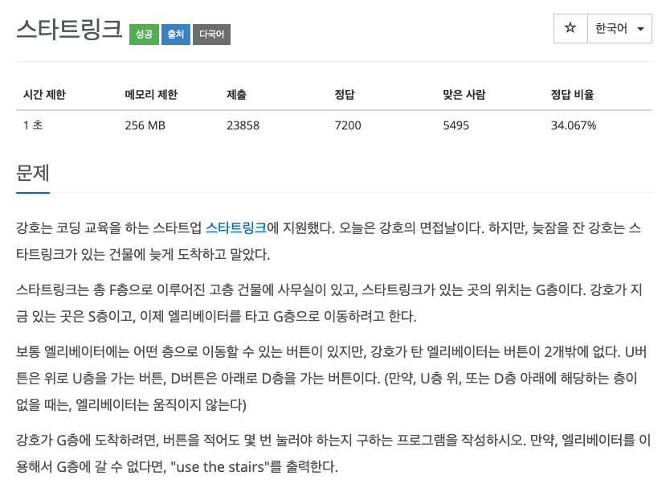
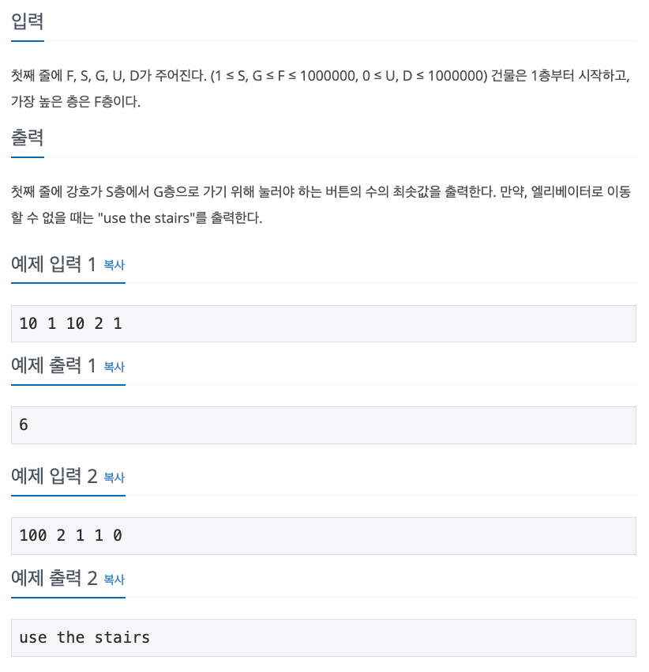

## 문제

[[백준 - JAVA] Gold 5 - 5014 스타트링크](https://www.acmicpc.net/problem/5014)




## 풀이

- 한 층에 두번째 방문부터는 신경쓸 필요가 없기 때문에 visited 배열을 통해 방문한 층들을 기억해놓았다.

<br/>

```java
import java.io.*;
import java.util.*;

public class Main {

	public static void main(String[] args) throws IOException {
		BufferedReader in = new BufferedReader(new InputStreamReader(System.in));

		StringTokenizer st = new StringTokenizer(in.readLine());
		int F = Integer.parseInt(st.nextToken());
		int S = Integer.parseInt(st.nextToken());
		int G = Integer.parseInt(st.nextToken());
		int U = Integer.parseInt(st.nextToken());
		int D = Integer.parseInt(st.nextToken());

		int answer = -1;
		boolean[] visited = new boolean[F+1];

		Queue<int[]> queue = new LinkedList<>();

		queue.add(new int[] { S, 0 });
		visited[S] = true;

		while (!queue.isEmpty()) {
			int[] cur = queue.poll();
			if (cur[0] == G) {
				answer = cur[1];
				break;
			}

			if (cur[0] + U <= F) {
				if (!visited[cur[0] + U]) {
					visited[cur[0] + U] = true;
					queue.add(new int[] { cur[0] + U, cur[1] + 1 });
				}
			}

			if (cur[0] - D > 0) {
				if (!visited[cur[0] - D]) {
					visited[cur[0] - D] = true;
					queue.add(new int[] { cur[0] - D, cur[1] + 1 });
				}
			}
		}

		if (answer != -1)
			System.out.println(answer);
		else
			System.out.println("use the stairs");
	}
}
```

<br/>

- S == G 일 경우를 생각하지 못해서 answer를 처음에 0으로 잡아서 오랫동안 풀지 못했다.
- 오랜만에 풀었더니 생각보다 간단한 BFS 문제도 오래걸렸다.
