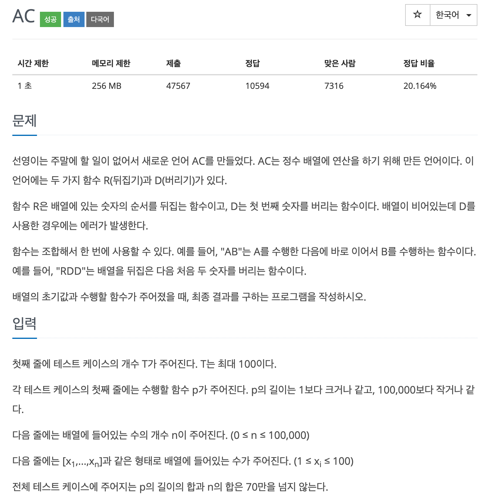
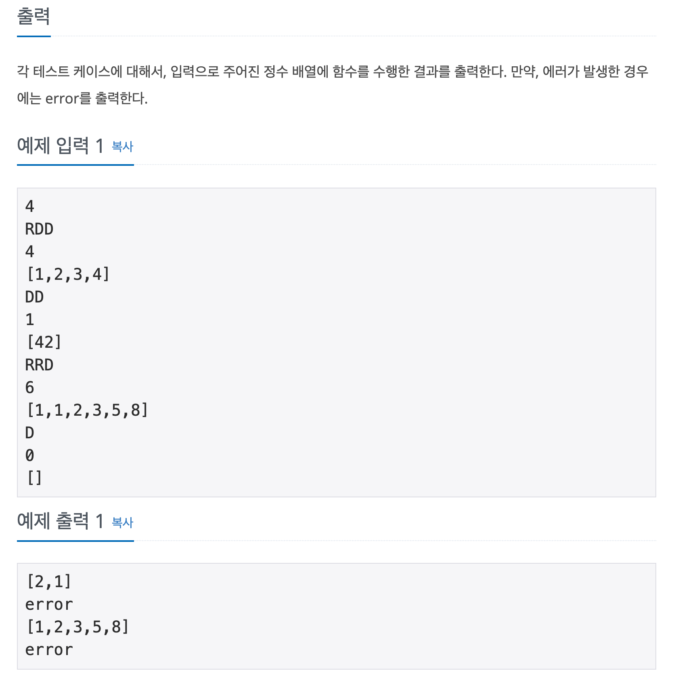

## 문제

[[백준 - JAVA] Gold 5 - 5430 AC](https://www.acmicpc.net/problem/5430)




## 풀이

- 구현 / 문자열 문제
- 구현 자체는 쉬웠는데, 예외 처리가 잘 안됐음

<br/>

```java
import java.io.*;
import java.util.*;

public class Main {

	static List<Integer> list;

	public static void main(String[] args) throws NumberFormatException, IOException {
		BufferedReader in = new BufferedReader(new InputStreamReader(System.in));
		StringBuilder sb = new StringBuilder();
		int T = Integer.parseInt(in.readLine());

		for (int t = 0; t < T; t++) {
			String p = in.readLine();
			int n = Integer.parseInt(in.readLine());
			list = new ArrayList<>();

			StringTokenizer st = new StringTokenizer(in.readLine(), "[],");
			for (int i = 0; i < n; i++) {
				list.add(Integer.parseInt(st.nextToken()));
			}
			boolean flag = false;
			boolean idx = false;
			int head = 0;
			int tail = n - 1;

			int len = p.length();
			for (int i = 0; i < len; i++) {

				if (p.charAt(i) == 'R') {
					idx = !idx;
				} else {
					if (head > tail) {
						sb.append("error").append("\n");
						flag = true;
						break;
					}

					if (!idx)
						head++;
					else
						tail--;
				}
			}

			if (flag)
				continue;

			sb.append("[");
			if (idx && head <= tail) {
				for (int i = tail; i > head; i--) {
					sb.append(list.get(i)).append(",");
				}
				sb.append(list.get(head));
			} else if (head <= tail) {
				for (int i = head; i < tail; i++) {
					sb.append(list.get(i)).append(",");
				}
				sb.append(list.get(tail));
			}
			sb.append("]\n");
		}
		System.out.println(sb);
	}
}
```

<br/>

- 정답까지 가는데 크게 두가지를 놓쳤다.
- 첫번째는 StringTokenizer를 처음부터 안써서 두자리 수 이상의 숫자들을 구분해내지 못한 것
- 두번째는 배열이 비어있어도 D를 호출하지 않는 이상 error가 아닌 빈 배열을 출력하는 것을 생각치 못했다.
- 구현 자체는 여러 방법으로 어렵지 않은 것 같았는데 이런 예외나 기본적인 처리들을 하지 못하여 오래걸렸다.
