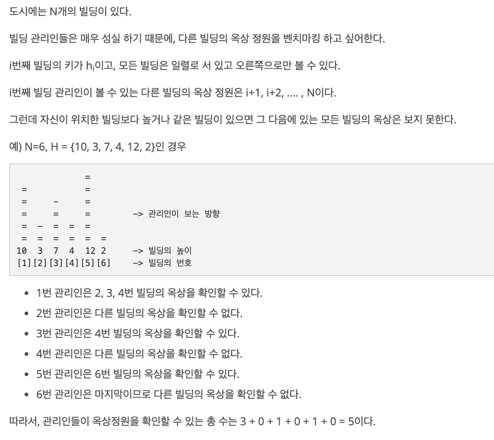

## 문제

[[백준 - JAVA] Gold 5 - 6198 옥상 정원 꾸미기](https://www.acmicpc.net/problem/6198)





## 풀이

- 스택 이용하는 문제

<br/>

```java
import java.io.*;
import java.util.Stack;

public class Main {

	public static void main(String[] args) throws NumberFormatException, IOException {
		BufferedReader in = new BufferedReader(new InputStreamReader(System.in));

		int N = Integer.parseInt(in.readLine());
		long answer = 0;

		Stack<Long> stack = new Stack<>();

		for(int i = 0 ; i < N ; i++) {
			long n = Integer.parseInt(in.readLine());

			while(!stack.isEmpty()) {
				if(stack.peek() <= n) {
					stack.pop();
				} else {
					break;
				}
			}
			answer += stack.size();
			stack.add(n);
		}

		System.out.println(answer);

	}
}

```

<br/>

- 스택을 이용하는 느낌이 강하게 드는 문제이긴 했는데 아이디어를 생각하는데에 시간이 굉장히 오래 걸렸다.
- 이번에도 등호를 안붙여서 시간이 더 오래 걸렸다. 문제를 잘 읽고 잘 기억하자.
