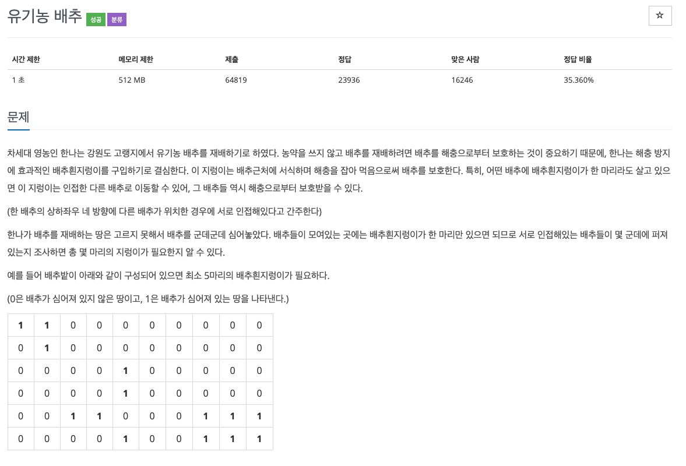
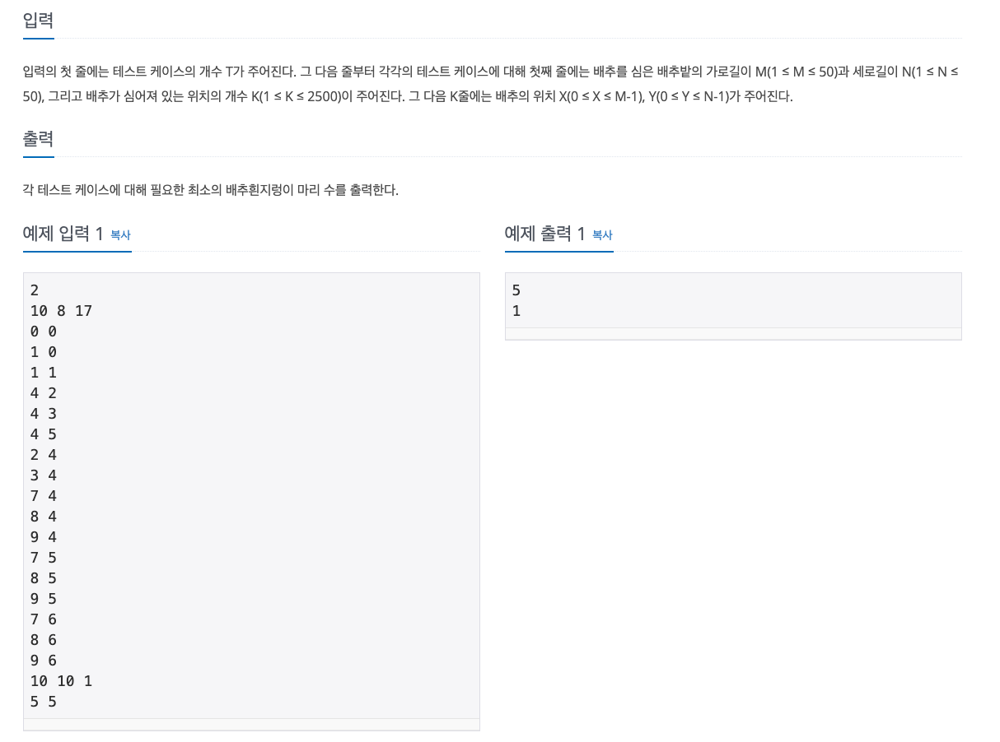

  
## 문제
[[백준 - JAVA] DFS - Silver 2 유기농 배추](https://www.acmicpc.net/problem/1012)


 
 


## 풀이
- 한번도 방문하지 않은 칸이면서 배추가 있는 칸들을 들어간다. 
- 들어가서 방문 체크하고 4방향 탐색하면서 배추가 있는 칸들에 또 들어가면서 방문체크 한다. 
- 모든 칸을 돌면서 한번도 방문하지 않으면서 배추가 있는 칸 들어갈 때마다 count 세준다. 


```java
import java.io.*;
import java.util.StringTokenizer;

public class BOJ_1012 {
	
	static int[] dx = {1, -1, 0, 0};
	static int[] dy = {0, 0, 1, -1};
	
	static void func(int x, int y, int[][] map, boolean[][] visited) {
		visited[x][y] = true;
		
		for(int i = 0 ; i < 4; i++) {
			if(!visited[x + dx[i]][y + dy[i]] && map[x + dx[i]][y + dy[i]] == 1)
				func(x + dx[i], y + dy[i], map, visited);
		}
	}

	public static void main(String[] args) throws NumberFormatException, IOException {
		BufferedReader in = new BufferedReader(new InputStreamReader(System.in));
		StringTokenizer st;
		int T = Integer.parseInt(in.readLine());
		
		for(int test = 0 ; test< T; test++) {
			st = new StringTokenizer(in.readLine());
			int M = Integer.parseInt(st.nextToken());
			int N = Integer.parseInt(st.nextToken());
			int K = Integer.parseInt(st.nextToken());
			int[][] map = new int[N + 2][M + 2];
			boolean[][] visited = new boolean[N + 2][M + 2];
			int x;
			int y;
			for(int i = 0 ; i < K ; i++) {
				st = new StringTokenizer(in.readLine());
				x = Integer.parseInt(st.nextToken());
				y = Integer.parseInt(st.nextToken());
				map[y + 1][x + 1] = 1;
			}
			int count = 0;
			for(int i = 1 ; i <= N; i++) {
				for(int j = 1 ;j <= M ; j++) {
					if(map[i][j] == 1 && visited[i][j] == false) {
						func(i, j, map, visited);
						count++;
					}
				}
			}
			System.out.println(count);
		}
	}
}


```

- 작년 학교에서 공부할 때 못풀고 남겨뒀던 문제..
- 지금 풀어보니 어렵지 않은 문제였다.
- 과거의 내 코드를 보니 너무 못해보여서 지금은 나름 성장한 것 같다.