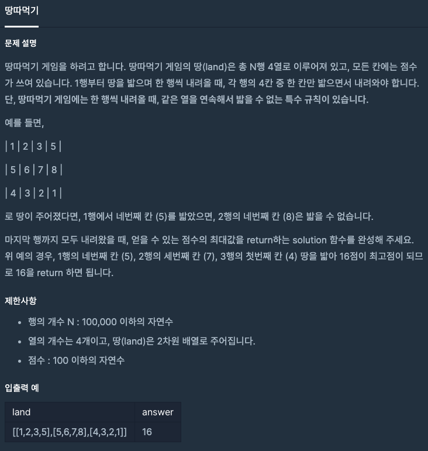

  
## 문제
[[프로그래머스 - JAVA] 연습문제 - Level 2 땅따먹기](https://programmers.co.kr/learn/courses/30/lessons/12913)

 

## 풀이

- 맨 윗행부터 내려오면서 각 행의 요소들 위치에서 가질 수 있는 최대 값을 구하는 방법
- Math.max() 함수 사용해 크기 비교 하였음 


```java
class Solution {
    int solution(int[][] land) {
        int answer = 0;
        
        for(int i = 1 ; i < land.length; i++){
            land[i][0] += Math.max(land[i-1][1], Math.max(land[i-1][2], land[i-1][3]));
            land[i][1] += Math.max(land[i-1][0], Math.max(land[i-1][2], land[i-1][3]));
            land[i][2] += Math.max(land[i-1][0], Math.max(land[i-1][1], land[i-1][3]));
            land[i][3] += Math.max(land[i-1][0], Math.max(land[i-1][1], land[i-1][2]));
        }
        
        int len = land.length - 1;
        answer = Math.max(land[len][0], 
                          Math.max(land[len][1], 
                                   Math.max(land[len][2], land[len][3])));
        

        return answer;
    }
}
```


---
- 재귀함수를 사용하는 방법으로 처음에 시도하였으니 구현하는데 오래걸리기도 하였고, 시간 초과가 발생하였다. 아마 내가 잘 구현을 못했을 가능성도 있다. 