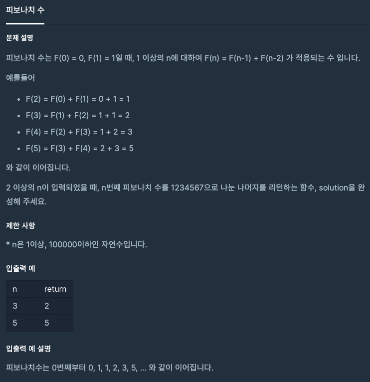

  
## 문제
[[프로그래머스 - JAVA] 연습문제 - Level 2 피보나치 수](https://programmers.co.kr/learn/courses/30/lessons/12945)

 

## 풀이

- 피보나치 수 0번째 값, 1번째 값은 상수로 만들어 놓음
- 피보나치 수를 더해가며 만드는데 1234567이 넘으면 1234567을 뺌
- 어차피 나머지를 구하는 것이기 때문에 1234567을 빼며 int 형의 범위를 넘지 않게 조절

```java
class Solution {
    public int solution(int n) {
        int answer = 0;
        int fn = 0;
        int fn0 = 0;
        int fn1 = 1;
        
        for(int i = 2 ; i <= n; i++){
            fn = fn1 + fn0;
            fn0 = fn1;
            fn1 = fn;
            
            if(fn0 > 1234567){
                fn0 -= 1234567;
                fn1 -= 1234567;
                fn -= 1234567;
            }   
        }
        
        answer = fn % 1234567;
        return answer;
    }
}
```


---
- int 형 범위를 넘어서는 값이 충분히 나올만한 상황이라 조절하는 데에 초점을 뒀다. 
- C++에서는 long long 을 썼었는데 자바는 long long 은 없어서 int 형으로 처리하려고 더 생각했다. 