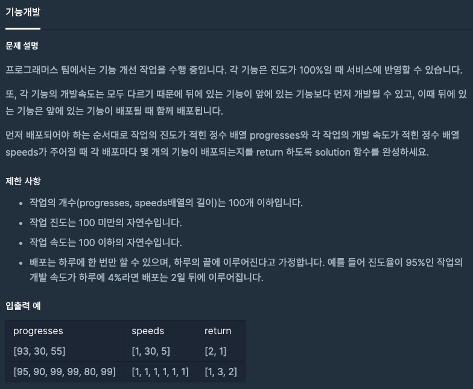
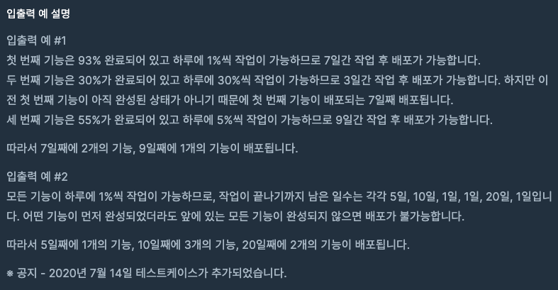

  
## 문제
[[프로그래머스 - JAVA] 연습문제 - Level 2 기능개발](https://programmers.co.kr/learn/courses/30/lessons/42586)

 
 

## 풀이

- progresses 배열에 speeds 배열 원소를 각각 더하고 
- progresses 배열의 원소 중 100 이상 되는 연속된 원소의 수를 count
- 다음 진행은 count된 원소 다음꺼부터 진행 


```java
import java.util.*;
class Solution {
    public int[] solution(int[] progresses, int[] speeds) {
        int[] answer = {};
        Vector<Integer> vec = new Vector<>();
        
        for(int i = 0 ; i < progresses.length; i++){
            int count = 0;
            
            for(int j = i ; j < progresses.length; j++)
                progresses[j] += speeds[j];
            
            if(progresses[i] >= 100){
                for(int j = i ; j < progresses.length; j++){
                    if(progresses[j] >= 100)
                        count++;
                    else
                        break;
                }
                vec.add(count);
            }
            i += count - 1;
            
        }
        answer = new int[vec.size()];
        for(int i = 0 ; i < vec.size(); i++)
            answer[i] = vec.get(i);
        
        return answer;
    }
}
```


- 풀고 나서 생각난 건데 이게 문제 영역이 스택/큐인데 전혀 사용하지 않고 풀게 되었다. 
- 그래서 스택/큐를 사용하여 푼 코드를 가져와보았다. 


## 다른 풀이 
```java
public int[] solution(int[] progresses, int[] speeds) {
	Stack<Integer> stack = new Stack<Integer>();

	for (int i = progresses.length - 1; i >= 0; i--)
		stack.add((100 - progresses[i]) / speeds[i] + ((100 - progresses[i]) % speeds[i] > 0 ? 1 : 0));

	List<Integer> s = new ArrayList<Integer>();

	while (!stack.isEmpty()) {
		int cnt = 1;

		int top = stack.pop();

		while (!stack.isEmpty() && stack.peek() <= top) {
			cnt++;
			stack.pop();
		}

		s.add(cnt);
	}

	int[] answer = new int[s.size()];

	for (int i = 0; i < answer.length; i++) {
		answer[i] = s.get(i);
	}

	return answer;
}
```


---