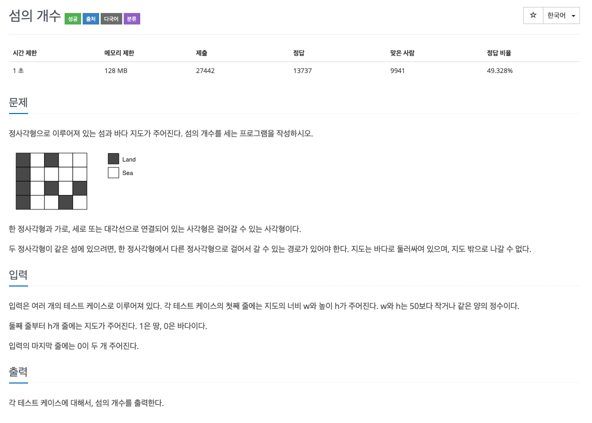
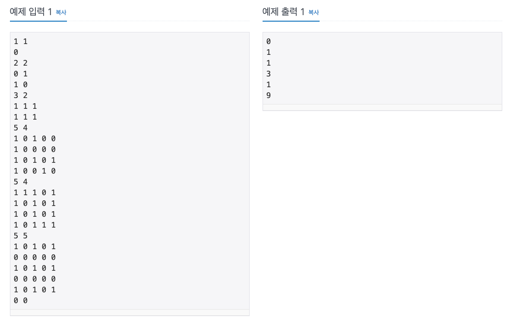

  
## 문제
[[백준 - JAVA] DFS - Silver 2 섬의 개수](https://www.acmicpc.net/problem/4963)

 
 


## 풀이
- DFS 사용 문제
- 8방향 탐색을 편하게 하기 위해 dx, dy 배열을 코드에서처럼 만들어 놓음.
- 재귀 함수 사용하여 땅인 곳에서 시작해서 주위 8방향 땅인 곳 방문
- 방문 체크해서 체크된 땅 다시 방문 안하도록 
- 모든 땅 방문하면서 새로 방문할 때마다 count 해줌  


```java
import java.io.*;

public class BOJ_4963 {

	static int[][] map;
	//static boolean[][] visited;
	static int[] dx = {0, 0, 1, 1, 1, -1, -1, -1};
	static int[] dy = {1, -1, 0, 1, -1, 0, 1, -1};
	static int count;
	
	static void func(int x, int y) {
		// 방문 체크 
		//visited[x][y] = true;
		
		// 8방향 체크 
		for(int i = 0 ; i < 8 ; i++) {
			int mx = x + dx[i];
			int my = y + dy[i];
			if(map[mx][my] == 1) {
				map[mx][my] = 0;
				func(mx, my);
			}
		}	
	}
	
	public static void main(String[] args) throws IOException {
		BufferedReader in = new BufferedReader(new InputStreamReader(System.in));
		
		while(true) {
			count = 0;
			
			// map 사이즈 입력 
			String[] arr = in.readLine().split(" ");
			int r = Integer.parseInt(arr[0]);
			int c = Integer.parseInt(arr[1]);
			
			// 종료 조건 검사 
			if(r == 0 && c == 0)
				break;
			
			map = new int[c + 2][r + 2];
			//visited = new boolean[c + 2][r + 2];
			
			// map 입력 
			for(int i = 1 ; i <= c ; i++) {
				arr = in.readLine().split(" ");
				for(int j = 1 ; j <= r; j++) {
					map[i][j] = Integer.parseInt(arr[j-1]);
				}
			}
			
			// 모든 칸을 함수의 시작점으로 설정하고 호출 
			for(int i = 1 ; i <= c ; i++) {
				for(int j = 1 ; j <= r ; j++) {
					if(map[i][j] == 1) {
						count++;
						func(i, j);
					}
				}
			}
			System.out.println(count);
		}
	}
}

```
