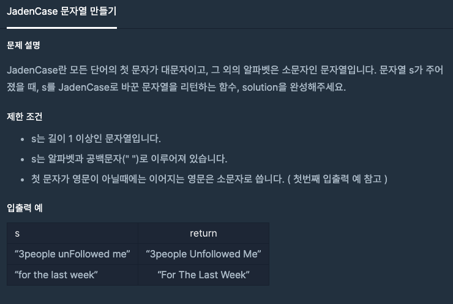

  
## 문제
[[프로그래머스 - JAVA] 연습문제 - Level 2 JadenCase 문자열 만들기](https://programmers.co.kr/learn/courses/30/lessons/12951)

 

## 풀이

- 첫 문자는 우선 대문자로 만들어 놓는다. 
- 두 번째 문자부터 전 문자가 공백이면 대문자로 만든다. 
- 공백이 아닐 경우 소문자로 만든다. 

```java
class Solution {
    public String solution(String s) {
        String answer = "";
        int len = s.length();
        String first = s.charAt(0) + "";
        s = first.toUpperCase() + s.substring(1);
        
        for(int i = 1 ; i < len; i++){
            if(s.charAt(i) == ' '){
                continue;
            }else if(s.charAt(i - 1) == ' '){
                s = s.substring(0, i) + (s.charAt(i) + "").toUpperCase() + s.substring(i+1);
            }else {
                s = s.substring(0, i) + (s.charAt(i) + "").toLowerCase() + s.substring(i+1);
            }
        }

        return s;
    }
}
```


- StringBuilder 를 사용하면 더 중간 과정이 빨랐을 것 같은데 사용법을 익혀놔야겠다. 


## 다른 풀이 

- 문자열의 모든 문자를 소문자로 만들어 놓는다. 
- flag 변수를 두고 반복문에서 공백이 나오면 flag 변수를 제어
- 조건연산자 사용하여 코드 간결화 

```java
class Solution {
  public String solution(String s) {
        String answer = "";
        String[] sp = s.toLowerCase().split("");
        boolean flag = true;

        for(String ss : sp) {
            answer += flag ? ss.toUpperCase() : ss;
            flag = ss.equals(" ") ? true : false;
        }

        return answer;
  }
}
```

- 다른 사람의 풀이 중 가장 깔끔해 보이는 코드를 가져와봤다. 
- toUpperCase(), toLowerCase() 같이 문자열 제어에 자주 쓰일 것 같은 메소드는 알아둬야겠다. 

---