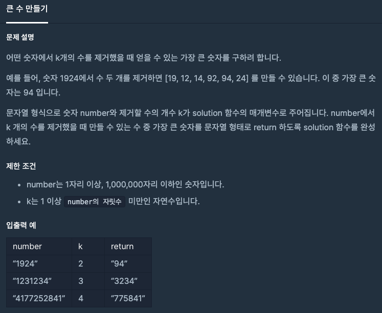

  
## 문제
[[프로그래머스 - JAVA] 탐욕법(Greedy) - Level 2 큰 수 만들기](https://programmers.co.kr/learn/courses/30/lessons/42883)

 

## 풀이

- k개를 제거한다는 것은 len - k개를 넣는다는 것
- index 0 부터 len - k 전까지의 최대값을 구해 answer 문자열에 채워넣는다는 느낌
- 최대값 구하고 다시 최대값 index 부터 반복
- 이렇게 풀면 시간초과가 생겨 숫자 9가 등장할 경우 추가적인 최대값 구하는 과정 없이 바로 추가하였음 

```java
class Solution {
    public String solution(String number, int k) {
        String answer = "";
        int len = number.length();
        int index = 0;
        char max;
        
        for(int i = 0; i < len - k; i++){
            max = '0';
            for(int j = index; j <= k + i; j++){
                if(max < number.charAt(j)){
                    max = number.charAt(j);
                    index = j + 1;
                }
                if(max == '9')
                    break;
            }
            answer += max + "";
        }
        return answer;
    }
}
```


- 이렇게 푸는게 맞나 싶다. 
- 탐욕법(Greedy) 개념을 아예 잊어 어떻게 푸는지 생각이 안났다. 

## 다른 풀이 

```java
import java.util.Stack;
class Solution {
    public String solution(String number, int k) {
        char[] result = new char[number.length() - k];
        Stack<Character> stack = new Stack<>();

        for (int i=0; i < number.length(); i++) {
            char c = number.charAt(i);
            while (!stack.isEmpty() && stack.peek() < c && k-- > 0) {
                stack.pop();
            }
            stack.push(c);
        }
        for (int i=0; i<result.length; i++) {
            result[i] = stack.get(i);
        }
        return new String(result);
    }
}
```

- 훨씬 시간적으로 효율적인 코드다. 
- 스택을 활용하여 앞의 수가 최대한 크게 유지하는 방법이다. 
- 어차피 숫자 전부를 이용하는게 아니고 앞자리가 크면 큰 수이기 때문에 앞자리만 크게 유지하면 된다는 생각을 왜 못했을까...

---