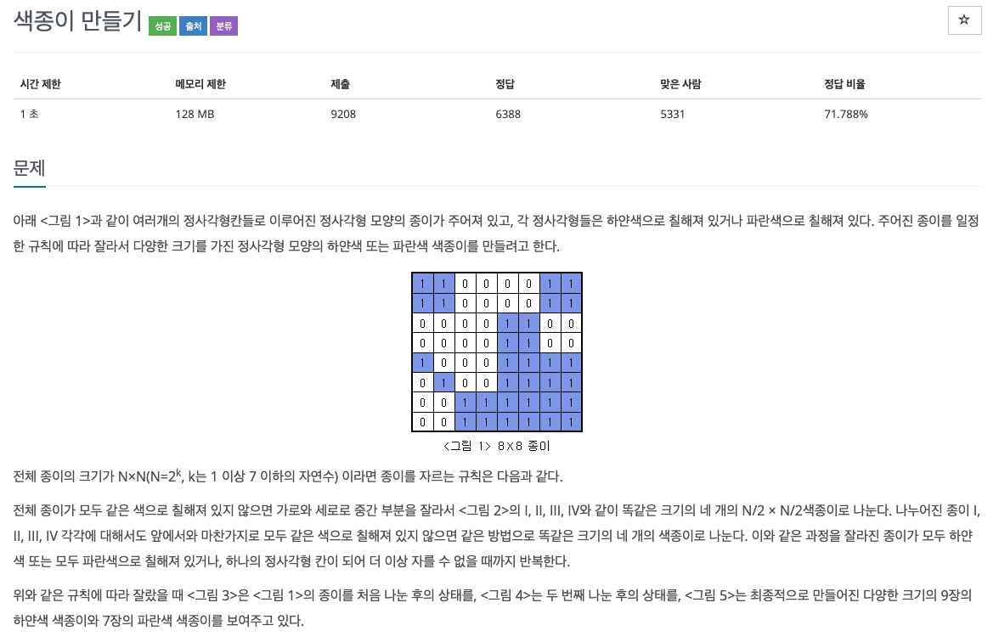
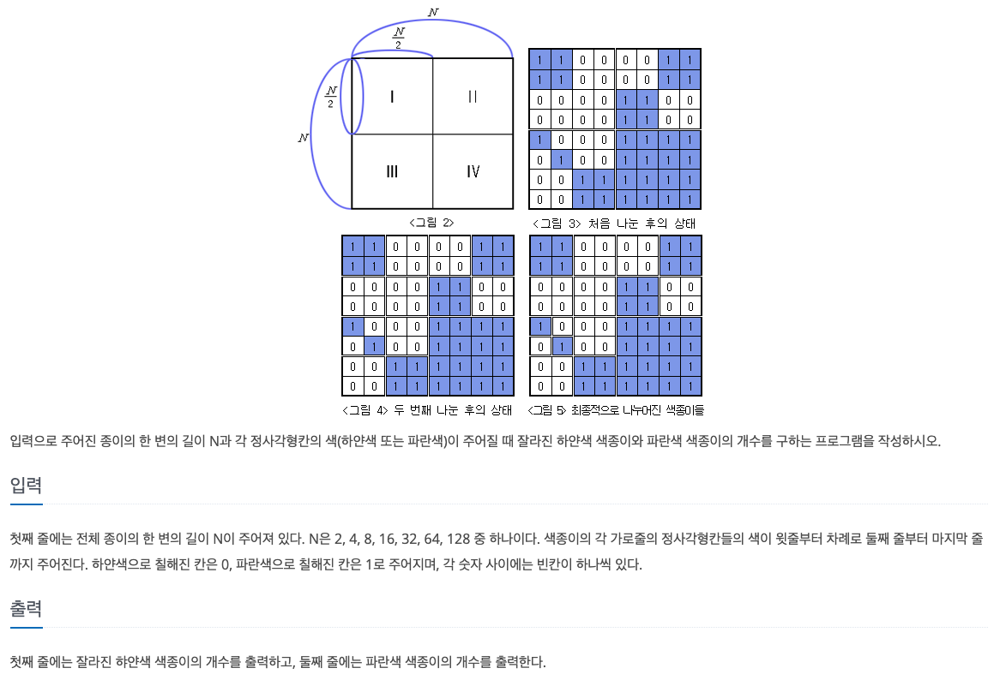

  
## 문제
[[[백준 - JAVA] 재귀 - Silver 2 색종이 만들기 (2630)](https://www.acmicpc.net/problem/2630)




## 풀이
- 재귀 함수 사용 
- map을 쭉 돌면서 다른 숫자가 등장하면 map을 4분해서 길이 / 2 만큼 각각 다시 돌게하였다. 
- 다른 숫자가 안등장하면 그 때의 숫자가 1일 때 cnt1++, 0일 때 cnt0++ 하는 방식 

```java
import java.io.*;
import java.util.StringTokenizer;

public class BOJ_2630_색종이만들기 {

	static int cnt0;
	static int cnt1;

	static void func(int n, int x, int y, int[][] map) {
		boolean check = true;
		int num = map[x][y];
		for(int i = x; i < x + n; i++) {
			for(int j = y; j < y + n; j++) {
				if(map[i][j] != num) {
					check = false;
				}
			}
		}
		
		if(!check) {
			int half = n / 2;
			func(half, x, y, map);
			func(half, x + half, y, map);
			func(half, x, y + half, map);
			func(half, x + half, y + half, map);
		} else {
			if(map[x][y] == 1)
				cnt1++;
			else
				cnt0++;
			return;
		}
	}
	
	public static void main(String[] args) throws NumberFormatException, IOException {
		BufferedReader in = new BufferedReader(new InputStreamReader(System.in));
		StringTokenizer st;
		int N = Integer.parseInt(in.readLine());
		int[][] map = new int[N+2][N+2];
		for(int i = 1 ; i <= N ; i++) {
			st = new StringTokenizer(in.readLine());
			for(int j = 1 ; j <= N ;j++) {
				map[i][j] = Integer.parseInt(st.nextToken());
			}
		}
		cnt1 = 0;
		cnt0 = 0;
		
		func(N, 1, 1, map);
		
		System.out.println(cnt0);
		System.out.println(cnt1);
	}
}


```
