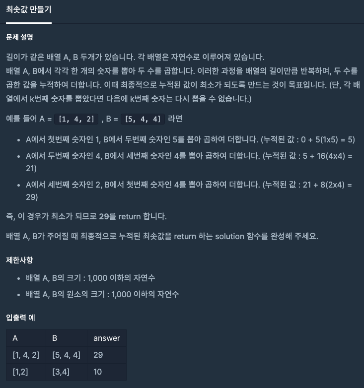

  
## 문제
[[프로그래머스 - JAVA] 연습문제 - Level 2 최댓값과 최솟값](https://programmers.co.kr/learn/courses/30/lessons/12941)

 

## 풀이

- 배열 A 와 B를 모두 정렬시킨다. (sort)
- 한 쪽의 큰 수와 다른 한 쪽의 작은 수의 곱으로 최소값을 구한다. 

```java
import java.util.*;
class Solution
{
    public int solution(int []A, int []B)
    {
        int answer = 0;
        int len = A.length;
        
        Arrays.sort(A);
        Arrays.sort(B);
        
        for(int i = 0; i < len; i++){
            answer += A[i] * B [len - 1 - i];
        }
    
        return answer;
    }
}
```


---