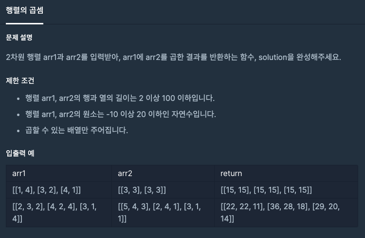

---
title: "[프로그래머스 - JAVA] 연습문제 - Level 2 행렬의 곱셈"
date: 2020-12-03 18:33:34
category: Algorithm
thumbnail: { thumbnailSrc }
draft: false
---
  
## 문제
[[프로그래머스 - JAVA] 연습문제 - Level 2 행렬의 곱셈](https://programmers.co.kr/learn/courses/30/lessons/12949)

 

## 풀이

- 행렬 곱셈 공식대로 구현
- 쉬운 문제여서 풀이 생략

```java
class Solution {
    public int[][] solution(int[][] arr1, int[][] arr2) {
        int[][] answer = {};
        answer = new int[arr1.length][arr2[0].length];
        
        for(int i = 0 ; i < arr1.length; i++){
            for(int j = 0 ; j < arr2[0].length; j++){
                for(int k = 0 ; k < arr1[0].length; k++){
                    answer[i][j] += arr1[i][k] * arr2[k][j];
                }
            }
        }
        
        return answer;
    }
}
```


---