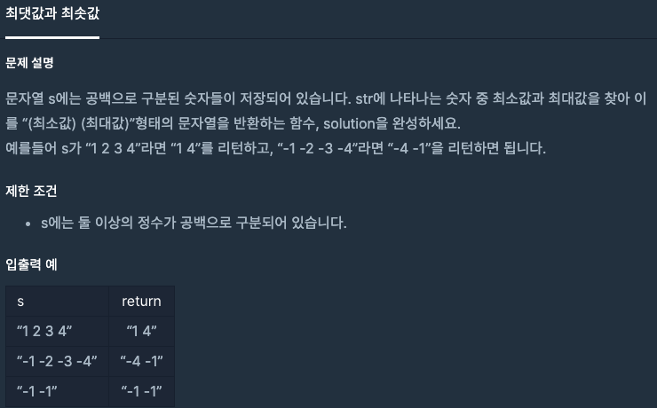

  
## 문제
[[프로그래머스 - JAVA] 연습문제 - Level 2 최댓값과 최솟값](https://programmers.co.kr/learn/courses/30/lessons/12939)

 

## 풀이

- 문자열 s 를 공백(" ")을 기준으로 split하여 숫자 1개씩 문자열 배열로 만들어준다. 
- 최댓값과 최솟값을 구한다. 

```java
class Solution {
    public String solution(String s) {
        String answer = "";
        
        String[] arr = s.split(" ");
        int max = Integer.parseInt(arr[0]);
        int min = Integer.parseInt(arr[0]);
        
        for(int i = 1 ; i < arr.length; i++){
            int n = Integer.parseInt(arr[i]);
            if(max < n)
                max = n;
            
            if( min > n)
                min = n;
        }
        
        answer += min + " " + max;
        
        return answer;
    }
}
```


---
- 문자열 split이 오래걸리는 연산이라는 생각에 다른 더 빠른 방법이 있나해서 다른 사람들의 풀이를 찾아보니 거의 나와 비슷했다. 
- List에 다 때려넣고 sort 하는 방법도 속도는 비슷하게 나오더라. 