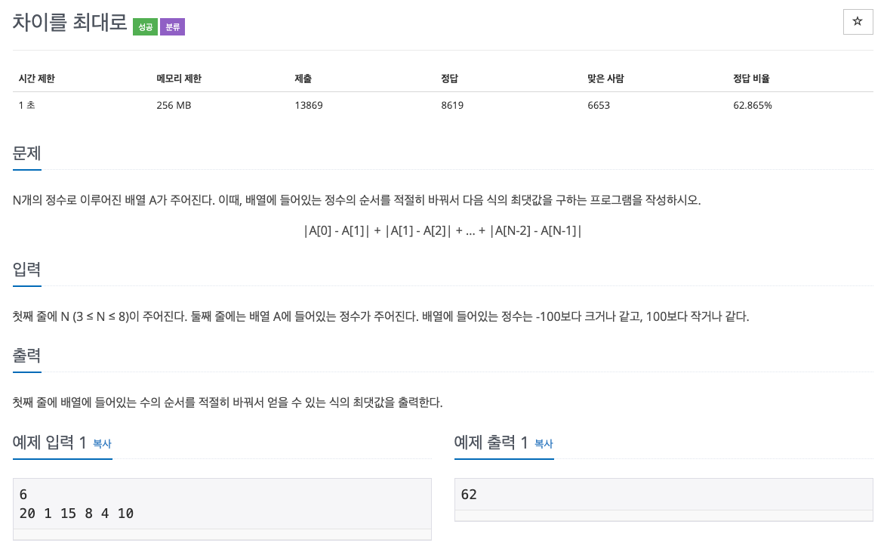

  
## 문제
[[백준 - JAVA] 완전탐색 - Silver 2 바이러스 (10819)](https://www.acmicpc.net/problem/10819)



## 풀이
- 만들 수 있는 모든 순서의 배열을 다 만들어본다. 
- 만들고 식에 맞는 값을 구해서 최대값을 구한다. 
- 완전 탐색 방법으로 하면 쉬운 문제. 

```java
import java.io.*;
import java.util.StringTokenizer;

/*
 * 백준 10819 차이를 최대로 
 */
public class BOJ_10819 {

	static int N;
	static int max;
	static int[] nums;
	static boolean[] visited;
	
	static int getMax(int[] arr) {
		int sum = 0;
		for(int i = 0 ; i < N - 1 ;i++) {
			sum += Math.abs(arr[i] - arr[i+1]);
		}
		return sum;
	}
	
	static void func(int cnt, int[] selected) {
		if(cnt == N) {
			if(max < getMax(selected))
				max = getMax(selected);
			return;
		}
		
		for(int i = 0 ; i < N; i++) {
			if(!visited[i]) {
				visited[i] = true;
				selected[cnt] = nums[i];
				func(cnt + 1, selected);
				visited[i] = false;
			}
		}
	}
	
	public static void main(String[] args) throws NumberFormatException, IOException {
		BufferedReader in = new BufferedReader(new InputStreamReader(System.in));
		N = Integer.parseInt(in.readLine());
		StringTokenizer st = new StringTokenizer(in.readLine());
		nums = new int[N];
		visited = new boolean[N];
		int[] selected = new int[N];
		max = 0;
		
		for(int i = 0 ; i < N ; i++) {
			nums[i] = Integer.parseInt(st.nextToken());
		}
		
		func(0, selected);
		
		System.out.println(max);
	}
}


```
