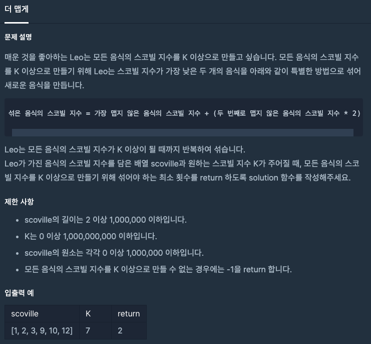

  
## 문제
[[프로그래머스 - JAVA] 힙 - Level 2 더 맵게](https://programmers.co.kr/learn/courses/30/lessons/42626)

 

## 풀이

- Priority Queue 사용
- scoville 배열의 원소를 다 queue에 넣고 2개씩 빼면서 섞어줌
- peek() 했을 때 K 보다 큰 수가 나올 때까지 섞음 
- 다 섞었는데도 안되면 -1 return

```java
import java.util.*;
class Solution {
    public int solution(int[] scoville, int K) {
        int answer = 0;
        
        PriorityQueue<Integer> queue = new PriorityQueue<>();
        for(int i = 0 ; i < scoville.length; i++){
            queue.add(scoville[i]);
        }
        
        while(queue.peek() < K){
            if(queue.size() < 2){
                answer = -1;
                break;
            }
            
            int num1 = queue.poll();
            int num2 = queue.poll();
            queue.add(num1 + num2 * 2);
            answer++;
        }
        
        return answer;
    }
}
```
 
- Priority Queue 사용하는 게 처음인 거 같다. 
- Priority Queue는 Heap을 응용한 대표적인 사례인 자료구조이다. 
- 알아서 우선순위에 의해 정렬된다는 특징이 있다. 

---