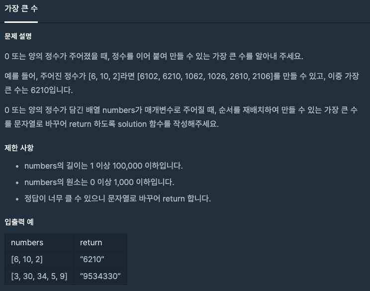

  
## 문제
[[프로그래머스 - JAVA] 정렬 - Level 2 가장 큰 수](https://programmers.co.kr/learn/courses/30/lessons/42746)

 

## 풀이

- 사전식 배열을 활용해서 정렬 함수를 만들었다. 
- 두 문자열을 각각 순서가 다르게 붙여서 크게 나오는 쪽이 앞에 가게끔 하는 compare 함수를 이용
- numbers 배열의 원소가 모두 0일 경우의 예외처리를 마지막에 해주었다. 

```java
import java.util.*;
class Solution {
    public String solution(int[] numbers) {
        String answer = "";
        
        String[] arr = new String[numbers.length];
        for(int i = 0 ; i < arr.length; i++){
            arr[i] = Integer.toString(numbers[i]);
        }
        
        Arrays.sort(arr, new Comparator<String>(){
            @Override
            public int compare(String str1, String str2){
                return (str2+str1).compareTo(str1+str2);
            }
        });$
        
        for(String i : arr)
            answer += i;
        
        // numbers의 모든 원소가 0일 경우 
        if(arr[0].equals("0"))
            answer = "0";
        
        return answer;
    }
}
```

- C++로 알고리즘 문제를 풀 때는 compare 함수를 내가 정의하여 정렬하는 것을 많이 해봤는데 자바로는 거의 처음 해보는 것 같다. 
- Comparator 클래스를 이용하여 compare 하는 방법을 잘 기억해두자. 

---