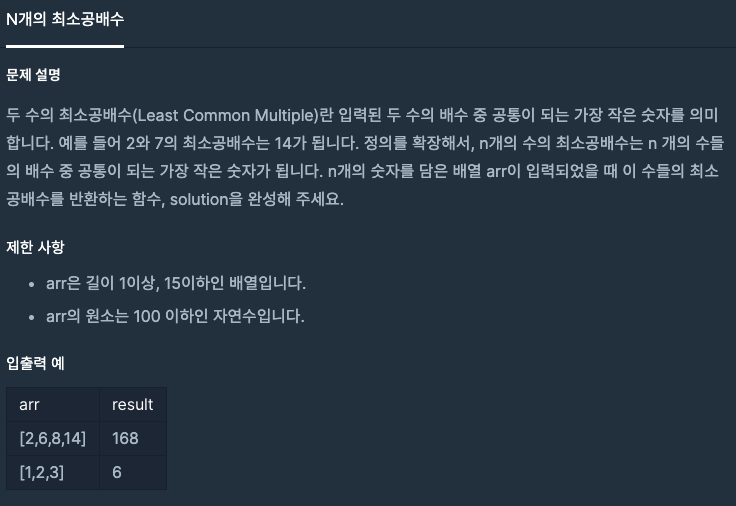

## 문제

[[프로그래머스] 연습문제 - Level 2 N개의 최소공배수](https://programmers.co.kr/learn/courses/30/lessons/12953)

 

## 풀이
- 최소공배수 = 두 수의 곱 / 두 수의 최대공약수 개념을 활용
- 주어진 배열의 첫째 수부터 다음 수와의 최소공배수를 구해가서 마지막 수까지 도달


```java
import java.util.*;
class Solution {
    public int solution(int[] arr) {
        int answer = 0;
        int len = arr.length;
        Arrays.sort(arr);
        
        for(int i = 0 ; i < len - 1; i++){
            int min = 0;
            int max = arr[i] * arr[i + 1];
            
            for(int j = 1; j <= 100; j++){
                if(arr[i+1] % j == 0 && arr[i] % j == 0)
                    min = j;
            }
            
            arr[i+1] = max / min;
        }
        answer = arr[len - 1];
        return answer;
    }
}
```

<br/>

- 처음 접근할 때 1부터 모든 수로 나눠지는 수가 나올 때까지 반복하는 방법을 생각했었는데 수의 범위가 너무 크고 시간도 오래걸려 이 방법이 아님을 빨리 깨달았다. 
- 하지만 최소공배수 = 두 수의 곱 / 두 수의 최대공약수 라는 개념을 생각해낼 때까지가 좀 오래걸렸다. 