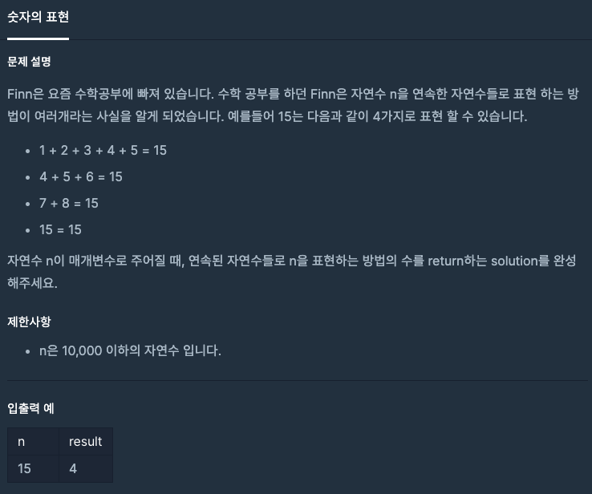

  
## 문제
[[프로그래머스 - JAVA] 연습문제 - Level 2 숫자의 표현](https://programmers.co.kr/learn/courses/30/lessons/12924)

 

## 풀이

- 1부터 시작해서 연속된 숫자들을 계속 더해간다. 
- n 보다 크거나 같아지면 Break, n과 일치하면 answer에 + 1 , 아니면 넘어간다. 
- 이런식으로 1부터 n까지 돈다.

```java
class Solution {
    public int solution(int n) {
        int answer = 0;
        
        for(int i = 1 ; i <= n; i++){
            int count = 0;
            for(int j = i ; j <= n; j++){
                count += j;
                if(count >= n)
                    break;
            }
            if(count == n)
                answer++;
        }
        
        return answer;
    }
}
```


---