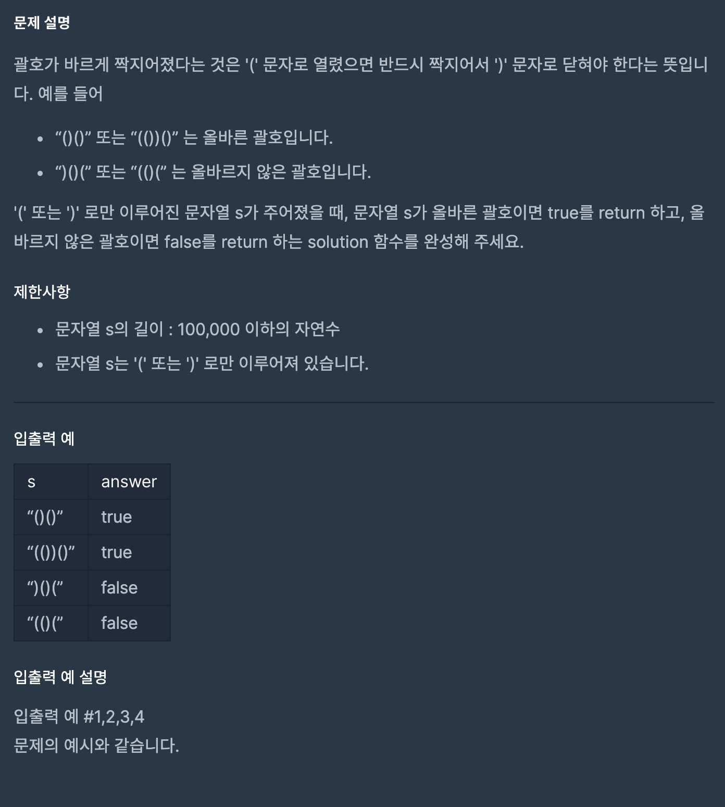

  
## 문제
 

## 풀이

- 문자열 s의 첫 문자부터 봐서 '(' 이면 스택에 추가
- ')'이면 스택에 있는 '(' 하나 제거
- 스택이 비어있는데 ')' 문자가 나올 경우 올바르지 않으므로 false 리턴

```java
import java.util.*;
class Solution {
    boolean solution(String s) {
        boolean answer = true;
        Stack<String> stack = new Stack<>();
        
        for(int i = 0 ; i < s.length(); i++){
            if(stack.empty() && s.charAt(i) == ')'){
                answer = false;
                break;
            }
            if(s.charAt(i) == '(')
                stack.push("(");
            else
                stack.pop();
        }

        if(!stack.empty())
            answer = false;
        
        return answer;
    }
}
```