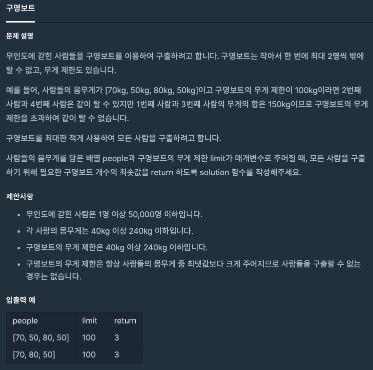

  
## 문제
[[프로그래머스 - JAVA] 탐욕법(Greedy) - Level 2 구명보트](https://programmers.co.kr/learn/courses/30/lessons/42885)

 

## 풀이

- 사람들 배열 무게순으로 정렬
- 가장 가벼운 사람 인덱스 i, 가장 무거운 사람 인덱스 j
- people[i] + people[j] 가 limit 보다 크면 무거운 사람 j는 보트 혼자 타야한다
- 따라서 j-- 하고 반복
- i가 j보다 작거나 같을 때까지 반복 

```java
import java.util.*;
class Solution {
    public int solution(int[] people, int limit) {
        int answer = 0;
        Arrays.sort(people);
        int i = 0;
        int j = people.length - 1;
        
        while(i <= j){
            if(people[i] + people[j] <= limit){
                answer++;
                i++;
                j--;
            }
            else{
                j--;
                answer++;
            }
        }
        return answer;
    }
}
```


---