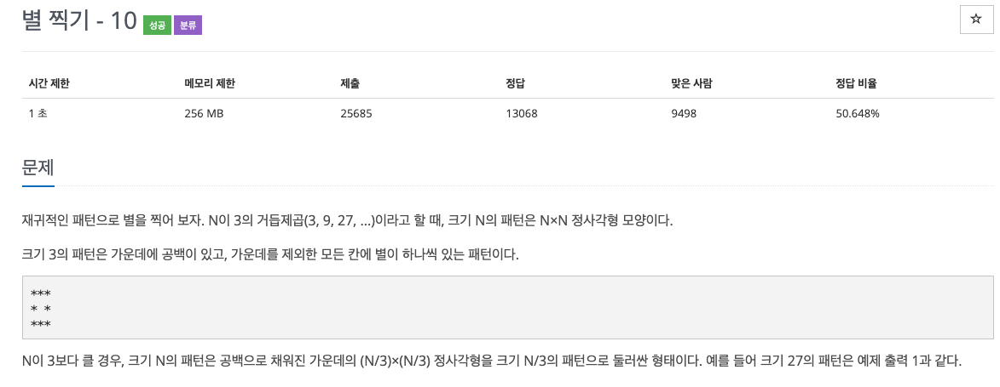
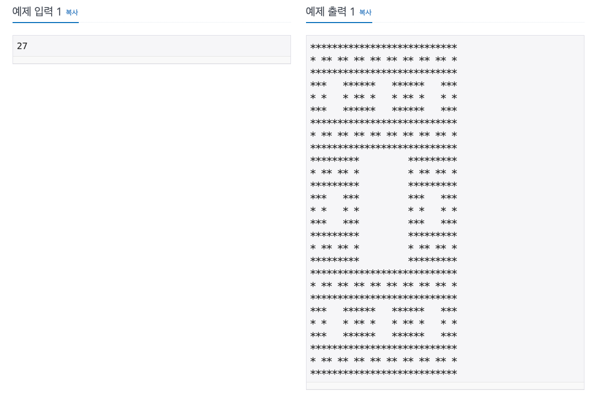

  
## 문제
[[백준 - JAVA] 재귀 - Silver 1 별 찍기 - 10](https://www.acmicpc.net/problem/2447)


 
 
 


## 풀이
- 재귀 함수 이용
- 우선 별 문자를 담을 char 2차원 배열 전체에 공백을 넣어준다. 
- 크기와, 시작 위치 를 매개변수로 가진 재귀 함수 func()을 만든다. 
- 크기를 3 by 3 으로 나눠가며 각 칸에 1/3된 크기고 재귀 함수를 호출한다. 
- 이 때 가운데 비어있는 위치는 건너뛰고 재귀함수를 호출해준다. 
- 크기가 1이 되면 해당 칸에 '*'를 넣어준다. 


```java
import java.io.*;

public class BOJ_2447 {

	// 별 저장할 배열 
	static char[][] star;
	
	static void func(int n, int x, int y) {
		if(n == 1) {
			star[x][y] = '*';
			return;
		}
		n /= 3;
		for(int i = 0 ; i < 3 ; i++) {
			for(int j = 0 ; j < 3 ; j++) {
				if(i == 1 && j == 1)
					continue;
				func(n, i * n + x, j * n + y);
				
			}
		}
	}
	
	public static void main(String[] args) throws NumberFormatException, IOException {
		BufferedReader in = new BufferedReader(new InputStreamReader(System.in));
		StringBuilder sb = new StringBuilder();
		int N = Integer.parseInt(in.readLine());
		star = new char[N][N];
		
		for(int i = 0 ; i < N ; i++) {
			for(int j = 0 ; j < N ; j++) {
				star[i][j] = ' ';
			}
		}
		func(N, 0, 0);
		
		for(int i = 0 ; i < N ; i++) {
			for(int j = 0 ; j < N ; j++) {
				sb.append(star[i][j]);
			}
			sb.append("\n");
		}
		System.out.println(sb);
	}
}

```
