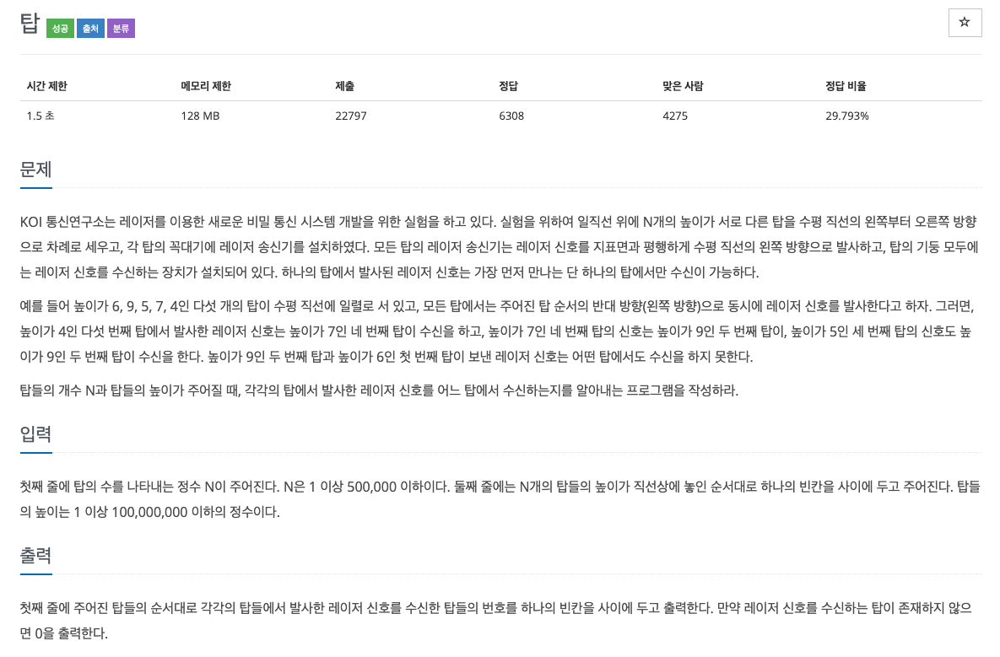
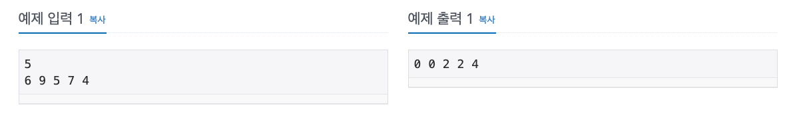

  
## 문제
[[백준 - JAVA] 스택 - Gold 5 탑 (2493)](https://www.acmicpc.net/problem/2493)




## 풀이
 
- 스택 활용 
- 탑 높이를 입력 받으면서 스택을 체크한다. 
- 스택이 비어있으면 이 전 탑 중 높은 탑이 없다고 생각하고 0 출력
- 그리고 나서 스택에 탑을 넣어준다. 
- 스택이 비어있지 않다면, 스택 맨 위 탑과 비교해 입력 받은 게 더 높으면 스택 맨 위 탑을 스택에서 제거
- 스택에서 더 높은 탑이 나올 때까지 반복
- 더 높은 탑이 나오면 더 높은 탑의 위치를 출력하고 입력 받은 탑을 스택에 넣어준다. 
- 마지막 입력 탑까지 이 과정을 한다. 

```java
import java.io.*;
import java.util.Stack;
import java.util.StringTokenizer;

public class BOJ_2493 {

	public static void main(String[] args) throws NumberFormatException, IOException {
		BufferedReader in = new BufferedReader(new InputStreamReader(System.in));
		StringBuilder sb = new StringBuilder();
		Stack<int[]> stack = new Stack<>();
		
		int N = Integer.parseInt(in.readLine());
		StringTokenizer st = new StringTokenizer(in.readLine());
		int i = 1;
		while(st.hasMoreTokens()) {
			int n = Integer.parseInt(st.nextToken());
			
			while(!stack.isEmpty()) {
				if(stack.peek()[1] > n) {
					sb.append(stack.peek()[0]).append(" ");
					break;
				}
				stack.pop();
			}
			
			if(stack.isEmpty()) {
				sb.append(0).append(" ");
			}
			stack.push(new int[]{i, n});
			
			i++;
		}
		
		System.out.println(sb);
	}
}

```
