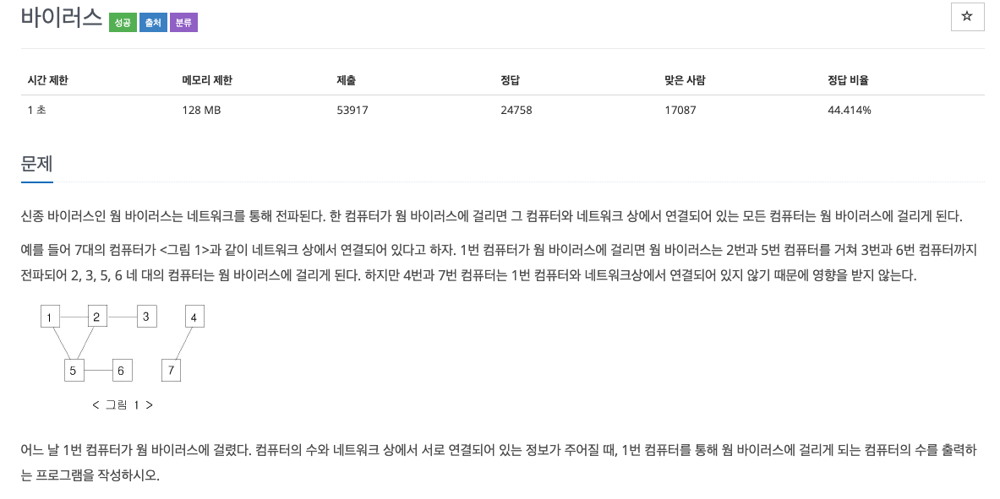
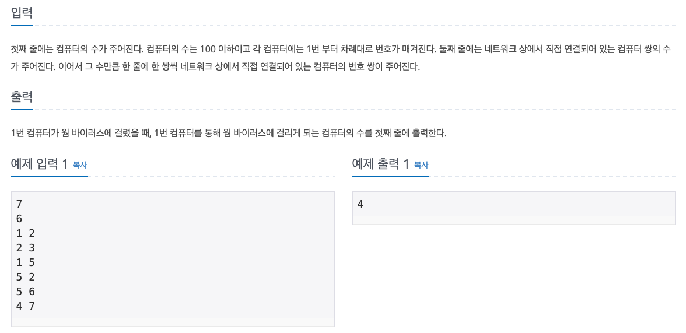

  
## 문제
[[백준 - JAVA] DFS - Silver 3 바이러스](https://www.acmicpc.net/problem/2606)




## 풀이
- 처음엔 Set을 이용해서 바이러스 감염된 컴퓨터를 저장하려고 했다. 
    - 하지만 스택오버플로우... 
- 바이러스 걸린 컴퓨터를 컴퓨터 번호별로 관리하기 위해 boolean 타입의 isVirus 배열 이용
- 1번 컴퓨터부터 연결되어있는 컴퓨터 검색하는 걸 이어가면서 isVirus 배열에 저장하며 방문까지 체크
- 연결 정보가 입력되는 숫자 중 뒤 컴퓨터가 감염일 경우도 주의! (이걸로 한번 틀림)

```java
import java.io.*;
import java.util.*;

public class BOJ_2606 {
	
	static int C;
	static int N;
	static void func(int n, int[] arr1, int[] arr2, boolean[] isVirus ){
		isVirus[n] = true;
		for(int i = 0 ; i < N; i++) {
			if(arr1[i] == n && isVirus[arr2[i]] == false) {
				func(arr2[i], arr1, arr2, isVirus);
			} else if(arr2[i] == n && isVirus[arr1[i]] == false) {
				func(arr1[i], arr1, arr2, isVirus);
			}
		}
	}

	public static void main(String[] args) throws NumberFormatException, IOException {
		BufferedReader in = new BufferedReader(new InputStreamReader(System.in));
		StringTokenizer st;
		
		C = Integer.parseInt(in.readLine());
		N = Integer.parseInt(in.readLine());
		
		int[] arr1 = new int[N];
		int[] arr2 = new int[N];
		boolean[] isVirus = new boolean[C + 1];
		
		for(int i = 0 ; i < N; i++) {
			st = new StringTokenizer(in.readLine());
			arr1[i] = Integer.parseInt(st.nextToken());
			arr2[i] = Integer.parseInt(st.nextToken());
		}
		
		func(1, arr1, arr2, isVirus);
		int count = 0;
		for(int i = 1 ; i <= C ;i++) {
			if(isVirus[i] == true)
				count++;
		}
		System.out.println(count - 1);
	}
}

```
