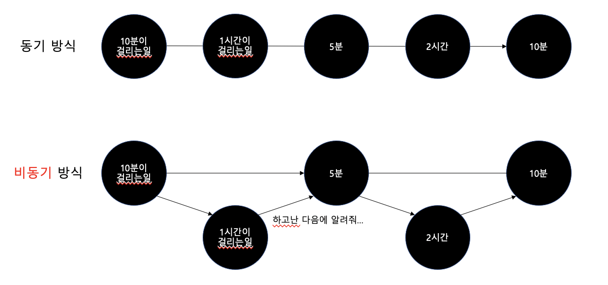
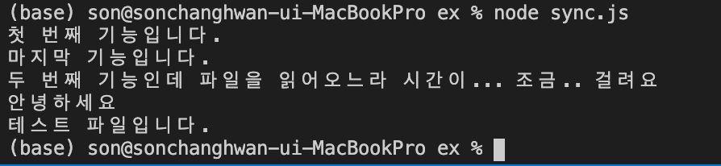
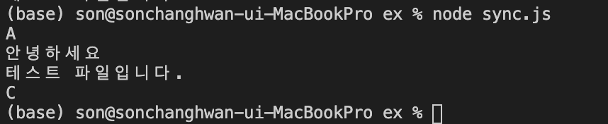
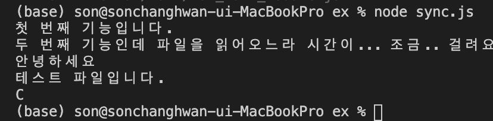

Node.js 는 비동기 IO를 지원하며 Single-Thread 기반으로 동작하는 서버이다. Node.js 서버는 비동기 받식으로 요청을 처리하므로 요청을 처리하면서 다음 요청을 받을 수 있다. 또한 병렬 처리를 Thread 로 처리하지 않으므로 Multi-Thread 가 갖는 많은 자원을 소모한다는 문제에서 자유롭다. 


Node.js 의 비동기 처리는 이벤트 방식으로 이루어진다. 클라이언트의 요청을 비동기 방식으로 처리하기 위하여 이벤트가 발생하며 서버 내부에 메시지 형태로 전달된다. 서버 내부에서 이 메시지를 Event Loop가 처리하게 되는데, 처리하는 동안 제어권은 다음 요청으로 넘어가고 처리가 완료되면 Callback 을 호출하여 처리 완료를 호출 측에 알려줍니다. 


Event Loop는 요청을 처리하기 위하여 내부적으로 약간의 Thread와 프로세스를 사용하게 되는데, 이는 Non-Blocking IO(작업을 즉시 할 수 없는 경우 에러를 반환하는 IO) 또는 내부 처리를 위한 목적으로만 사용되지 요청 처리 자체를 Thread로 하지는 않는다. 따라서 Node 서버는 Multi-Thread 방식의 서버에 비하여 Thread 수와 Overhead 가 훨씬 적다. 


이벤트를 처리하는 Event Loop는 Single-Thread 로 이루어져 있다. 즉 요청 처리는 하나의 Thread 안에서 처리된다는 의미다. 그래서 이벤트 호출 측에는 비동기로 처리되지만 처리 작업 자체가 오래 걸린다면 전체 서버 처리에 영향을 준다. 이는 Node.js 의 치명적인 약점으로 볼 수 있다.

<br/>

## 동기 / 비동기 프로그래밍 방식의 차이점

### 사람이 일을 할 때


동기적 : 일의 순서가 중요할 때 하나하나 처리

비동기적 : 동시에 일을 지시하고 끝날 때까지 대기 




### 비동기 방식 코드

- Fs.readFile : 하드디스크에서 파일 읽음

→ 시간이 오래 걸림

```jsx
var fs = require('fs'); 
// require : 라이브러리를 import 하는 것 

console.log('첫 번째 기능입니다.');
fs.readFile('example/test.txt', 'utf8', function(err, result) {
    if(err) {
        console.error(err);
        throw err;
    }
    else {
        console.error("두 번째 기능인데 파일을 읽어오느라 시간이... 조금.. 걸려요");
        console.log(result);
    }
});
console.log('마지막 기능입니다.');
```




<br/>

### 동기 방식 코드

```jsx
var fs = require('fs'); 
// require : 라이브러리를 import 하는 것 

console.log('A');

var result = fs.readFileSync('example/test.txt', 'utf8');

console.log(result);

console.log('C');
```




<br/>

### Callback 함수

```jsx
var fs = require('fs'); 
// require : 라이브러리를 import 하는 것 

function callbackFunc(callback) {
    console.log('첫 번째 기능입니다.');
    fs.readFile('example/test.txt', 'utf8', function(err, result) {
        if(err) {
            console.log(err);
            throw err;
        }
        else {
            console.error("두 번째 기능인데 파일을 읽어오느라 시간이... 조금.. 걸려요");
            callback(result);
        }
    });
}

callbackFunc(function (data) {
    console.log(data);
    console.log('C');
});
```



